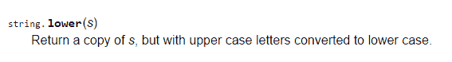
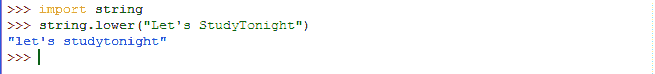

# 在 Python 中使用模块和相关函数

> 原文：<https://www.studytonight.com/python/modules-and-functions>

在[之前的教程](numbers-and-math-functions)中，我们学习了数学模块。我们还检查了它的一些功能，如`sin`、`log`等。，并且也学会了如何使用它们。现在就像数学模块一样，python 库中还有其他几个模块可以直接在任何 python 程序中使用。其中一些模块非常重要，没有这些模块，程序员根本无法制作任何现实生活中的应用。

在本课中，我们将重温模块及其功能，并尝试更好地理解它们。

* * *

## 功能位于模块内部

将模块视为另一段 python 代码，保存在 python 包中的某个地方，您可以在任何其他(或您的)python 代码文件中重用模块文件中的代码。现在试着回忆一下我们导入`math`模块后做了什么。我们测试了在`math`模块中定义的一些功能，如`math.floor(8.4)`、`math.sin(3.14159)`等。

**注:**`pow(5,2)``math.floor(8.4)``sin(3.14159)`都是调用函数的例子。

要了解我们如何使用`import`语句来导入外部模块，如**数学**模块，请检查实时示例，

[现场示例→](/code/python/using-math-module.php)

如果，我们上面写的只是调用和使用这些函数的一种方式。执行这些复杂数学运算的实际逻辑(代码)存储在哪里？即计算提供值的*功率*、*楼层*或*正弦*。所有这些(代码或逻辑)都位于模块文件中，称为**功能定义**。函数定义设置了规则，即函数如何解释所提供的输入，对其执行一些操作，以及作为输出或结果返回什么。

事实上，是函数定义本身决定了函数的输入和输出的**类型**和**数量**(输出总是一个，但输入可以是多个)。这些输入有一个官方术语，它们被称为**参数**。

**参数:**定义接受的输入类型的结构，同时定义函数。

**参数:**调用/使用函数时作为输入插入的实际值。

假设我们已经创建了一个模块文件**study now . py**(`.py`表示它是一个 python 代码文件；没错。你也可以自己创建一个模块文件，毕竟只是 python 代码)。在模块文件中，我们定义了一个可以求解二次方程`ax<sup>2</sup> + bx + c = 0`的函数。让函数名为`qSolver(a, b, c)`。

使用这个函数只需要提供`a`、`b`、`c`的值，即方程的系数值，函数就会打印出这两个解是否真实，是什么。那么，让我们看看如何导入模块并使用函数。

**步骤 1:** 首先导入模块。

```
>>> import StudyTonight
```

**第二步:**接下来用适当的参数调用函数，例如`2x<sup>2</sup>-6x+3=0`、`a=2`、`b=-6`和`c=3`。因此我们会打电话给，

```
>>> qSolver(2, -6, 3)
```

您不必在 IDLE 上尝试此功能，因为这不起作用。为什么呢？因为我们实际上没有在你的本地系统(笔记本电脑/电脑)中创建任何名为【今晚学习】的模块。这只是为了向您解释模块和函数实际上是如何工作的，以及我们如何使用自己定义的函数创建自定义模块。为了从模块中调用每个函数，您必须遵循相同的步骤。

python 已经有很多可用的模块了。当您安装 python 时，一些可能已经安装在您的系统中，而另一些可以从互联网轻松下载。这完全取决于你需要什么。

* * *

### 如何使用模块中定义的函数

使用模块中定义的函数时，您应该知道以下事项:

1.  您必须知道哪个模块包含该功能。
2.  Check if it's already in your system. If it is, then all good, otherwise go ahead and download it from the internet.

    (**注意:**可以通过在 IDLE 中导入该模块进行检查。错误意味着它不在那里。)

3.  接下来，确定您想要使用的函数的名称。为此，您可以参考 python 的[文档](https://docs.python.org/2/index.html)。
4.  参考文档检查它需要的参数数量，它们的含义和顺序。
5.  接下来，调用函数。 *<模块-名称>* 是模块的名称， *<功能-名称>* 是功能的名称和*<agr ument-1>**<自变量-2 >* ...是函数的参数。

```
>>> <module-name>.<function-name>(<argument-1>, <argument-2>, ...)
```

请注意，参数的数量取决于我们使用的函数。在某些情况下，函数可能不接受任何参数。这完全取决于您调用的是哪个函数，因此在使用任何函数之前，您必须查看文档以查看函数定义。上面调用的函数可能返回值，也可能不返回值(函数的输出)。在某些情况下，我们经常需要存储输出以备将来使用。我们通过将它存储在一个变量中来做到这一点，我们已经在[上一节教程](variables-in-python)中学习过了。

```
>>> variable-name = <module-name>.<function-name>(<argument-1>, <argument-2>, ...)
```

这只有在函数返回任何值(输出)时才有意义。此外，函数只能返回一个输出值，或者根本不返回。

让我们用我们到目前为止所理解的，使用一个在`string`模块中定义的函数`lower()`。

* * *

#### 附加主题(什么是字符串？)

[String](string-in-python) 只是一个用来指代像`"Studytonight"`这样的单词或者像`"Studytonight is a good website"`这样的句子的术语。

它们必须用单引号或双引号('...'括起来/ "...").在[上一章](operators-in-python)中，我们已经解释了如何将它们存储在变量中。存储字符串的变量叫做**字符串变量**。

现在`string`模块不同于上面解释的字符串。这只是一个名为**字符串**的模块，定义了函数对字符串变量执行各种操作。

因此，`string`模块由一些处理字符串操作的函数组成。在下面的例子中，我们将使用`lower()`，它用于将字符串的每个字符转换为小写。

1.  我们已经知道`string`是由功能`lower()`组成的库/模块。
2.  导入`string`模块检查是否可用。因为它是一个基本模块，所以它很可能会在那里。
3.  查看文档，在模块页面找到功能`lower()`。它会给你使用它所需的信息。



5.  它只有一个字符串参数。因此，创建一个字符串变量，其值为*“让我们今晚研究一下”*。
6.  接下来调用函数，

```
>>> string_variable = "Let's StudyTonight"
>>> string.lower(string_variable)
```

或者，如果你想直接一点，不要浪费内存去保存一个变量，就像这样做，

```
>>> string.lower("Let's StudyTonight")
```

像我们上面做的那样调用一个函数只会在我们点击回车时打印结果。就像这样，



如您所见，返回值将所有大写字母(大写字母)转换为小写，即 **L** 到 **l** 、 **S** 到 **s** 和 **T** 到 **t** 。如果您使用了一个变量，请记住，使用这样的函数不会修改原始变量的值。因此，即使在使用该函数后，`string_variable`的值仍将保持不变。因此，如果您愿意，可以将修改后的值保存在其他变量中，甚至保存在同一个变量本身中，例如:

```
>>> string_variable = string.lower(string_variable)
```

该语句完全有效，因为 python 将从右向左编译所有内容，即它将首先使用`string.lower()`获取修改后的字符串，然后使用`=`(等于)运算符将输出值分配给`string_variable`变量。

* * *

* * *