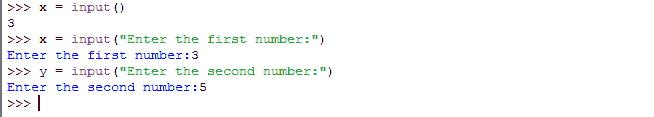

# Python 中的输入和输出

> 原文：<https://www.studytonight.com/python/input-and-output>

如果你仔细想想，你会意识到你使用的大多数真实世界的程序或软件都需要用户的一些输入。

无论是任何智能手机应用，如*脸书*或 *Instagram* ，在这里您必须首先输入您的电子邮件/用户名和密码才能登录，然后以文本或照片的形式发布一些帖子，以便在您的个人资料中使用。或者，在任何订票软件中，你首先必须指定火车/公共汽车/电影的名称；等等。

软件是一组程序，一起工作来执行一项任务或解决一个问题，这使我们的生活更容易。并且为了执行任何任务或者解决问题，软件必须知道问题的参数(或者，要执行的任务)。这是程序从用户那里获取*输入*的地方。同样，在接受这些输入后，程序必须处理它们并返回一些结果。这就是*输出*进入画面的地方。

在本课中，我们将学习如何用 python 创建一个程序，该程序可以从用户那里获取一些输入并打印出来。

* * *

## 从用户处获取输入

如果你还记得的话，我们在[第一个教程](getting-started-with-python)中使用了一个代码片段来演示 python 语法与其他编程语言相比是多么的简短和方便。

我们将 python 的代码与`C++`和`Java`的代码进行了比较。如果你还记得的话， [C++](/cpp/introduction-to-cpp.php) 和 [Java](/java/overview-of-java.php) 都需要一些额外的头文件(类似于 python 中的模块)来获得一些用户输入，而在 python 中只需要一行代码。

假设你想用 python 做一个简单的计算器。为此，您必须从用户那里获取一个或两个输入值，然后对输入的数字执行用户要求的数学运算并返回输出。为简单起见，我们先把用户要求的数学运算修正为**加法**为现在。

我们可以稍后在简单的计算器中添加更多的操作，但是现在让我们继续添加。为了执行加法，您必须从用户那里获得两个数字作为输入(很像普通的计算器)。输入必须是分配给存储在变量中的或**的**(比如`x`和`y`)。下面是接受用户输入的代码，让我们看看:****

```py
>>> x = input()
```

将上面的代码行写在 IDLE 中，然后按回车键。你会注意到光标不会移动到新的`>>>`线上。相反，它将开始等待用户输入。

这是你从键盘输入任何数字的时间(比如说，`3`)。只需输入任意数字，再次按回车键，现在您将看到带有`>>>`的换行符。

就像这样，使用`input()`函数(是的，它是一个内置函数)，您只需在变量`x`中存储一个值。为了让它更花哨，试试这个:

```py
>>> x = input("Enter the first number:")
```

[现场示例→](/code/python/input-output-example.php)

现在您会注意到下一行将打印消息:*“输入第一个数字:“*”并将等待用户输入。正如您可能已经猜到的那样，打印这样的消息将通知用户，他们应该输入一个值/数字/输入，以便程序继续运行。一个好的程序应该总是有这样直观的信息。

接下来，询问`y`变量的值。

```py
>>> y = input("Enter the second number:")
```



现在，是时候玩一会儿了。再次尝试输入变量`x`或`y`，这次尝试输入任何字母或字符串，而不是输入数字。当你按回车键时，你会看到 python 会抛出一个错误。

但是在 python 3.x 中，raw_input()函数被移除，input()被用来获取 numeri、strings 等各种值。

* * *

### 输出

现在我们如何在屏幕上显示输入值？你可能认为我们所要做的只是键入变量并按回车键。是的，我们一直都在这样做，但这只在你在 IDLE 中有效。

在创建真实世界的 python 程序时，您必须编写明确输出字符串或数字的语句。

我们用`print`语句来做。考虑一下，打印一个流行的语句**“你好，世界”**。为此，只需键入，

```py
>>> print ("Hello, World");
```

不要忘记引号，*双*或*单*，两者都可以。按回车键，您将看到报表打印在底部。如果你试着只写**《你好，世界》**并去掉打印语句，比如，

```py
>>> "Hello, World"
```

你会看到这也将打印该行，然而这一次在它周围有*引号*。这就是如何区分这两种方法。接下来，让我们尝试打印一个数字:

```py
>>> print (9)
```

现在试着把两个字符串打印在一起。创建两个[变量](variables-in-python)、`a`和`b`。给它们分配两个字符串值，

```py
>>> a = "Hello"
>>> b = "World"
```

现在一起打印出来。

```py
>>> print (a + b);
HelloWorld
```

这是它必须出现的方式。这个例子展示了 python 如何用两种方式解释一件事情。这里`+`运算符，用于连接两个字符串，而不是执行数学加法(这实际上不可能在两个字符串上执行)。因为两个字符串的数学相加没有任何意义，所以每当 python 遇到两个字符串之间有一个`+`运算符时，它只会将两个字符串连接起来。

上述操作也可以以另一种方式执行:

```py
>>> print ("Hello" + "World");
HelloWorld
```

现在试着打印一个数字并串在一起。

```py
>>> print (5 + " is a number");
```

你会得到一个错误。你能猜到为什么吗？

这是因为我们试图将一个*整数*与一个*字符串*连接起来。所以我们在这里建立一个规则-

> *“在打印时，我们不能将两种不同类型的文字混淆。”*

解决方案？我们必须将数字`5`转换成字符串。一种方法是，

```py
>>> print ("5" + " is a number")
```

或者，

```py
>>> print (str(5)+ " is a number");
```

`str()`函数，只是另一个可以用来将整数转换成字符串的内置函数。当涉及到将数字变量(由数字组成的变量)转换为字符串时，这非常有用。比如，

```py
>>> x = 1
>>> print (str(x)+ "st rule of Fight Club we don't talk about Fight Club");
1st rule of Fight Club we don't talk about Fight Club
```

最后，让我们用加法函数来完成我们的计算器。到目前为止，这就是我们所做的:

```py
>>> x = input("Enter the first number")
>>> y = input("Enter the second number")
```

现在，是时候输出了。

```py
>>> print (x+y);
```

或者，

```py
>>> print (str(x+y));
```

两者将给出相同的输出。虽然`x+y`的结果是一个数字，`str(x+y)`的结果是一个字符串。

* * *

* * *