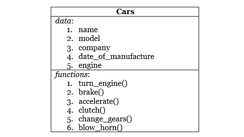

# Python 中的面向对象概念——更多示例

> 原文：<https://www.studytonight.com/python/oops-basics-python>

正如我们已经讨论过的与[类](class-in-python)、对象、[继承](inheritance-in-python)等相关的一般概念，使用的是前面[教程](oops-in-python)中的一个例子。在本教程中，我们将详细阐述这些主题。

* * *

## 目标

正如在前面的[教程](oops-in-python)中已经讨论过的，对象是一个物理实体，而类是一个逻辑定义。一个对象可以是任何类似的东西——设计学校记录注册表时的学生，文具物品管理程序中的笔，或者制造商汽车数据库程序中的汽车。它有三个重要的特征，它们是:

1.  **身份**:身份是指可以用来识别一个类的对象的某种信息。可以是学生的名字，汽车的公司名称等。
2.  **属性**:该对象的属性称为属性。比如年龄，性别，对一个学生的 DOB、或发动机类型、汽车的档位数量。
3.  **行为**:任何物体的行为都等同于它所能执行的功能。在面向对象程序设计中，可以给一个类的对象分配一些函数。举个例子，像学生会读/写，汽车会加速等等。

* * *

## 班级

类是定义属性和行为的蓝图。例如，如果圣雄甘地，萨钦·坦杜尔卡，你和我是对象，那么**人类**就是一个类。对象是面向对象程序设计的基本概念，但是类提供了定义相似类型对象的能力。

在类中，数据和将对该数据进行操作的函数被捆绑为一个单元。

比如说有一个叫`Car`的类，它有一些基本的数据，比如——名称、型号、品牌、制造日期、发动机等，还有一些功能比如**打开发动机**、**踩刹车**、**加速**、**挂档**、**吹喇叭**等。现在所有的基本特征都在我们的类`Car`中定义了，我们可以通过设置属性名称、模型等的值来创建它的对象，并且类`Car`的对象将能够使用在其中定义的函数。



* * *

## 数据隐藏

数据隐藏帮助我们定义来自外部世界的数据隐私，或者准确地说，来自其他类别的数据隐私。这样做的原因是为了创建访问对象数据的几个级别，并防止它被意外修改。此外，也可以对功能进行隐藏或设置隐私级别。

在 OOP 中，类内的数据可以定义为**公共**、**私有**或**受保护**。私有数据或函数是不能从类外部访问或看到的，而公共数据或函数可以从任何地方访问。受保护的数据或功能，或多或少表现得像公共的，但不应该从外部访问。

* * *

## 数据的抽象

类使用抽象的概念。类通过向用户隐藏复杂的实现细节来封装相关数据和对数据进行操作的函数。用户需要关注一个类做什么，而不是它如何做。

* * *

## 包装

封装，是一个对象存在的核心原因之一。从一开始，我们就一直在谈论对象，它的数据，功能，隐私等。现在是时候知道这一切是如何被限制的了。答案是封装。虽然听起来很像胶囊，但实际上是一样的。这里我们尝试将属于同一类的数据和函数封装在一起。

* * *

## 遗产

正如在前面的教程中所解释的，继承是指在一个地方定义一组核心属性和函数，然后通过继承定义它们的类来重用它们。

Python 支持**简单**、**多**和**多级**继承。我们将在继承教程中详细介绍这些内容。

* * *

## 多态性

多态，或 **Poly + Morph** ，意思是**“多形态 sb** 。确切地说，[多态性](python-polymorphism)是任何函数或运算符的属性，这些函数或运算符可以根据它们被输入的内容而有所不同。

多态性可以通过两种不同的形式实现，它们是:

### 函数重载

在面向对象程序设计中，使用[函数重载](method-overriding-in-python)，可以使一个函数有不同的行为。我们所要做的就是，用不同的参数创建不同的同名函数。例如，考虑一个函数`add()`，它将它的所有参数相加并返回结果。在 python 中，我们将它定义为，

```py
def add(a, b):
	return a + b;
```

这能够执行如下函数调用:

```py
>>> add(4,5)
```

上面的`add`函数总是以 2 个数字作为输入，但是如果你想一次加 3 个数字或者可能加 4 个数字呢？

因此，在面向对象程序中，你可以简单地再次定义函数`add`，这次是用 3 个参数，这种机制被称为**函数重载**。

```py
# to add 3 numbers
def add(a, b, c):
	return a + b + c;

# to add 4 numbers
def add(a, b, c, d):
	return a + b + c + d;
```

现在我们可以用两个、三个或四个参数调用`add()`函数。这里可以看到，函数`add()`现在有多种形态。

### 操作员超载

你知道什么算符是:**加法**、**除法**、**乘法**等。Python 能够根据情况以不同的方式读取运算符。例如，

```py
>>>print(2 + 5)
```

它会给你输出`7`，但是在做什么

```py
>>>print( "hello" + "world")
```

给你输出`"helloworld"`。我们可以在这里看到，`+`运算符在与数字一起使用时执行数学加法运算，但在与字符串一起使用时执行串联运算。

类似地，乘法运算符也根据其使用的变量的数据类型而有所不同。例如，

```py
>>>print( 3*7)
```

当在弦上时，给出，`21`，

```py
>>> print("hello"*3)
```

它给出，`"hellohellohello"`。这是[操作员超载](python-operator-overloading)的又一个例子。

* * *

* * *