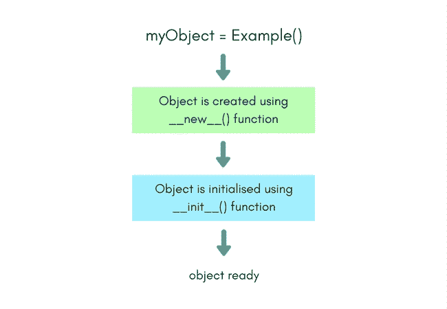

# 创建类对象的 Python 构造函数

> 原文：<https://www.studytonight.com/python/constructors-in-python>

在上一个教程中，我们学习了如何创建一个类、它的实例以及如何访问类成员(变量和函数)。在本教程中，我们将通过学习更多关于课程的知识来提高我们对课程的理解。到目前为止，已知`class`关键字用于初始化一个类的定义，后跟该类的名称。用**冒号**结束第一行后，我们移动到下一行，并在提供适当的缩进后开始定义变量或方法。

* * *

## 什么是构造函数？

正如在上一个[教程](class-in-python)中看到的，我们知道有两种方法可以声明/定义一个类的变量。

首先，通过简单地在类中定义它，甚至用一些值初始化它，然后在那里，非常像:

```py
class Example:
	myVariable = "some value";
```

第二种方法是在类的任何**函数**中使用`self`关键字声明它们。

此外，可以在声明变量时为它们赋值，但有时这些变量的值可能会因同一类的不同对象而异。在这种情况下，您必须在对象创建后为变量赋值。

同样，这可以通过两种方式实现。首先，通过直接从对象调用每个变量，使用点`.`符号，如:

```py
>>> myObject.myVariable = "some other value";
```

或者我们也可以要求用户输入:

```py
>>> myObject.myVariable = input();
```

除此之外，我们还可以使用`self`关键字分配/修改类函数中的变量值。

```py
class Example:
	def anotherFunction(self, parameter1):
		self.myVariable = parameter1;
		# or by calling for a user input
		self.myVariable = input();
```

如果我们在类中定义了这样的函数，那么可以通过调用`anotherFunction()`方法并将所需的值作为参数传递给该方法/函数来初始化或重新初始化对象的变量。

```py
>>> myObject = Example()
>>> myObject.anotherFunction("Amazing Spiderman")
>>> print (myObject.myVariable)
```

神奇的蜘蛛侠

可以看出，这是`Example`类中一个常用的用户定义函数，它利用参数来初始化变量。这里的概念相当简单。虽然，有更好的东西存在，它使用几乎相同的原则，是一个明确的标准。它被称为**建造者**。

**构造函数**是一种特殊类型的函数，每当创建该类的对象时都会自动调用。例如，

```py
>>> myObject = Example();
```

通过在上面的代码中写入`Example()`，我们通知 python`myObject`是类`Example`的对象。这正是调用该类的构造函数的时候。

但是它会做什么呢？一般来说，构造函数用于初始化对象(实例)的类的变量，尽管它也可以执行一些其他任务，比如检查是否有足够的资源，用于初始化任何变量的值是否有效等。

* * *

## 在类中定义构造函数方法

在 python 中，对象创建部分分为两部分:

1.  对象创建
2.  对象初始化

* * *

### 对象创建

对象创建由名为`__new__`的`static`类方法控制。因此当你调用`Example()`来创建类`Example`的对象时，这个类的`__new__`方法被调用。默认情况下，Python 为每个类都定义了这个函数，尽管您也可以显式地这样做，以玩转对象创建。

```py
class Example:
    def __new__(self):
        return 'studytonight';

# creating object of the class Example
mutantObj = Example()

# but this will return that our object 
# is of type str
print (type(mutantObj))
```

在上面的例子中，我们使用了`__new__`函数来改变返回对象的 tyoe，只是为了向您展示我们可以使用该函数做什么。

要了解默认的`__new__`函数是如何工作的，运行下面的代码，您会看到这次创建的对象是`Example`类型的

```py
class Example:
	myVariable = "some value";

simpleObj = Example()
print (type(simpleObj))
```

* * *

### 对象初始化

对象初始化由名为`__init__`的**实例**方法控制，该方法通常也称为**构造器**。虽然`__new__`和`__init__`一起组成了一个构造器。

一旦对象被创建，你可以通过在你的类中定义一个`__init__`方法来确保对象中的每个变量都被正确初始化，这意味着**初始化**。

因此，类名是什么并不重要，如果你想为这个类编写一个构造函数(初始化你的对象)，它必须是`__init__()`方法。在这个函数中，你可以自由地声明一个[类](class-in-python)变量(使用`self`)或者初始化它们。下面是我们的`Example`类使用`__init__`方法的一个快速示例:

```py
class Example:
	def __init__(self, value1, value2):
	    self.myVariable1 = value1;
		self.myVariable2 = value2;
		print ("All variable initialized")
```

一旦你在一个类中定义了`__init__`方法，那么在创建一个对象的时候，当你调用`Example()`的时候，你可以提供对象的变量所需要的所有必要参数，因为当我们调用`Example()`的时候，场景后面的 python 会自动为创建的对象调用`__init__`函数。

这是代码的外观:

```py
>>> myObj = Example("first variable", "second variable")
```

你可以用很多方法来初始化这个函数。上面已经提到了一种使用参数的方法，另一种方法是在构造函数中请求用户输入。

```py
def __init__(self):
	self.myVariable1 = input();
	self.myVariable2 = input();
```

下面我们有一个图表总结了这一切。



* * *

* * *