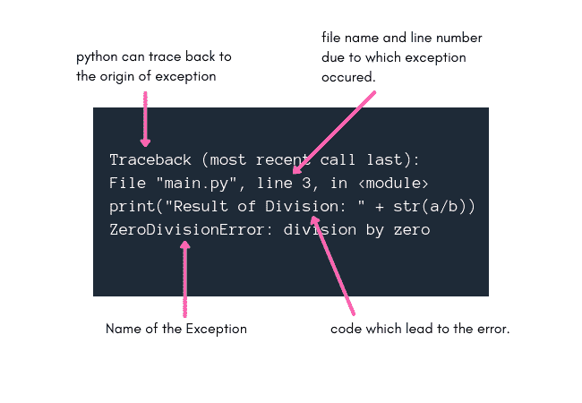

# Python 错误和内置异常

> 原文：<https://www.studytonight.com/python/introduction-to-error-exception-python>

在任何编程语言中，一个小小的打字错误都可能导致错误，因为在用任何编程语言编码时，我们都必须遵循语法规则。

python 的情况也是如此，在本教程中，我们将了解 python 中的语法错误和异常，并列出 python 中一些常见的异常。

* * *

## Python:语法错误

这是最常见和最基本的错误情况，在这种情况下，您违反了任何语法规则，例如，如果您使用 Python 3.x 版本，并且您编写了以下代码来打印任何语句，

```py
print "I love Python!"
```

语法错误:调用“打印”时缺少括号。

因为，从 Python 3 开始，使用`print`语句的语法发生了变化。同样的，如果你忘记在`if`条件的末尾加上冒号(`:`，你会得到一个**语法错误**:

```py
if 7 > 5
    print("Yo Yo!")
```

语法错误:无效语法

因此，语法错误是您在 python 中编码时会遇到的最基本的错误类型，通过查看错误消息并按照 python 语法纠正代码，可以轻松修复这些错误。

* * *

## Python:什么是例外？

与语法错误相反，异常是一种由于代码在执行过程中出现故障而导致的错误。

您的代码可能没有任何语法错误，但在执行时仍会导致异常。

我们举一个最基本的**除以零**的例子:

```py
a = 10
b = 0
print("Result of Division: " + str(a/b))
```

回溯(最近一次调用最后一次):文件“main.py”，第 3 行，在<module>打印中(“除法结果:“+ str(a/b))”零除法错误:被零除</module>

正如我们在输出中看到的，我们得到了**zero divisiononerror**，而我们的 python 代码的语法是绝对正确的，因为在这种情况下，错误或者我们应该说异常是在代码执行时生成的。

Python 返回非常详细的**异常消息**，让我们了解异常的起始点和原因，这样我们就更容易修复代码了。

* * *

### 用 Python 解码异常消息



异常消息中的术语**追溯**意味着 python 已经将代码追溯到异常发生的地方，并将在这一行之后显示相关消息。

如上图所示，异常消息的第二行告诉我们 python 文件的**名称，以及代码**的确切**行号，这是异常生成的原因。**

如果这对某人仍然没有帮助，在异常消息的第三行，将打印导致异常的完整代码语句。

然后在最后一行，python 告诉我们发生了哪个异常/错误，在我们上面的例子中是**zero divisiononerror**。

* * *

### 内置的 Python 异常类

让我们了解几个异常类以及它们出现的常见原因，以供将来参考。

**注意:**我们称它们为异常类，因为所有这些在 python 中都被定义为类。

| 异常类 | 描述 |
| 属性错误 | 当我们试图访问的属性(无论是赋值还是取值)不存在时，就会出现这个异常。**例如:**试图访问类中未定义的类成员变量。 |
| 导入错误 | 找不到导入的模块时会出现此异常。 |
| 内建 Error | 当代码缩进有问题时，会出现此异常。 |
| 类型错误 | 当对不正确类型的变量执行操作时。 |
| 值错误 | 当函数的参数值不正确时。 |
| 零分割错误 | 如上所述，当我们试图用零除一个数时。 |
| TabError | 当缩进在整个代码中不一致时，就用于缩进的制表符和空格而言。 |
| 运行时错误 | 当错误不是任何特定定义的异常类型时，python 会将其称为 RuntimeError。 |
| 名称错误 | 当我们试图使用的变量名没有定义时。 |

这些是用 python 编码时最常见的一些内置 excpetion 类。对于 python 中的所有异常类型，请查看 python 官方文档。

* * *

* * *