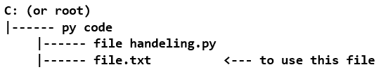
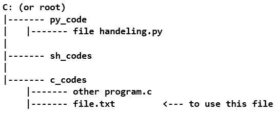

# Python 中的文件处理

> 原文：<https://www.studytonight.com/python/file-handling>

并非在所有情况下，数据都应该直接取自用户。当您必须从存储的原始文件中获取数据时，可能会出现这种情况，在这种情况下，您必须将这些文件与程序连接起来，以便程序可以读取、写入或修改数据。

在本节中，我们将了解如何执行这些任务。

* * *

## 文件访问模式

由于将文件与 Python 一起使用有各种各样的目的(即读、写、追加)，所以每次都指定 Python 应该对文件进行哪些操作是很重要的。因此，在程序中打开文件时，我们必须指定各种访问模式。

Python 能够管理两种类型的文件- **文本**(或普通字符)和**二进制**(仅包含 1 和 0 的文本)。除了访问模式之外，还需要指定要打开的文件类型。

* * *

## Python -打开文件

为了将我们的程序与所需的文件连接起来，我们需要一个可以在其中读取或写入数据的流。为此，已经有一些内置的类/函数可以用来解决这个问题。我们需要做的第一件事是创建一个文件对象，即文件类的实例，我们可以使用`file()`或`open()`函数来完成。为了打开一个文件-

```
>>> myFile = open([path of file], [access mode], [buffer size])
```

这里我的文件将是文件的对象，`open()`方法将打开在【文件路径】中指定的文件。其他两个参数，[访问模式]将提供访问模式，[缓冲区大小]将要求从文件中检索多少数据块。虽然，最后两个参数[访问模式]和[缓冲区大小]完全是可选的。默认情况下，如果没有指定访问模式，则认为是读取模式。[文件路径]可以是文件的完整路径，或者如果它与程序存在于同一文件中，则仅提供名称就足够了。更清楚的是-



在上述情况下，写作

```
>>> myFile = open("file.txt")
```

就足够了。然而，在像这样的情况下-



请注意，这次您的 **file.txt** 与上述情况不在同一个文件夹中，因此这里您必须指定整个位置。

```
>>> myFile = open("C:/c_code/file.txt")
```

一旦文件被打开，就有一个指针指向文件中的某个位置。该指针用于从该位置读取/写入。这个指针非常像一个文本光标，它可以自由移动(使用箭头键)，或者用于从文本中写入或删除文本，除了指针只能通过某些功能移动/读取/写入。

关于现在的访问模式，以下是将在参数中指定的可用访问模式-

1.  **读取模式-**T0 为文本文件，`"rb"`为二进制文件。文件指针指向文件的开头。

    ```
    >>> myFile = open("file.txt", "r")
    ```

2.  **写入模式-** `"w"`为文本文件，`"wb"`为二进制文件。文件指针指向文件的开头。

    ```
    >>> myFile = open("file.txt", "w")
    ```

3.  **追加模式-** `"a"`为文本文件，`"ab"`为二进制文件。文件指针指向文件的末尾。

    ```
    >>> myFile = open("file.txt", "a")
    ```

4.  **读/写模式-** `"r+"`或`"w+"`提供对同一文件对象进行读和写操作的选项。`"rb+"`或`"wb+"`为二进制文件。文件指针指向文件的开头。

    ```
    >>> myFile = open("file.txt", "r+")
    ```

5.  **追加/读取-** `"a+"`启用读取/追加模式，`"ab+"`为二进制文件的追加/读取模式。文件指针指向文件的末尾。

    ```
    >>> myFile = open("file.txt", "a+")
    ```

如您所见，以这种方式打开文件非常类似于创建一个文件对象，并对其执行读/写操作。以这种方式打开文件会创建一个数据缓冲区流，在使用文件后，总是建议关闭这个流。这可以使用关闭功能来完成。例如，关闭我的文件流

```
>>> myFile.close()
```

使用文件的另一种方式是使用`with`关键字。查看语法会清楚这是如何工作的-

```
with open("file.txt", "r+"):
		// operations to perform on "file.txt"
		// there can be many
		// syntax is pretty much like that of methods 
```

通过这种方式，您实际上是在为要使用的文件创建一个范围。一旦程序离开这个范围，文件就会自动关闭。

下一节将详细介绍如何将数据读写到文件中。

* * *

* * *