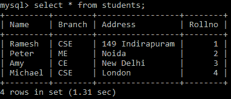

# Python MySQL -从表中选择数据

> 原文：<https://www.studytonight.com/python/python-mysql-select-data-from-table>

在本教程中，我们将学习**如何从 python 中的 MySQL 表**中检索数据，既有完整的表数据，也有一些特定列的数据。

## Python MySQL -选择数据

在 MySQL 中，为了从表中检索数据，我们将使用`SELECT`语句。其语法如下:

```
SELECT column_names FROM table_name
```

## 从 MySQL 表中检索所有记录

为了从表中获取所有记录，使用`*`代替列名。让我们从之前插入的**学生**表中检索所有数据:

```
import mysql.connector as mysql

db = mysql.connect(
    host = "localhost",
    user = "yourusername",
    passwd = "yourpassword",
    database = "studytonight"
)

cursor = db.cursor()

## defining the Query
query = "SELECT * FROM students"

## getting records from the table
cursor.execute(query)

## fetching all records from the 'cursor' object
records = cursor.fetchall()

## Showing the data
for record in records:
    print(record)
```

因此，上述代码的输出将是:

(‘Ramesh’、‘CSE’、‘149 individuals’、‘1’、‘Peter’、‘me’、‘noida’、‘2’、‘Amy’、‘ce’、‘新德里’、‘3’、‘Michael’、‘CSE’、‘London’、‘4’

下面是我们运行 python 代码时的确切输出快照:



在下一节中，我们将学习如何从表中检索特定列的数据。

## 从表的特定列中检索数据

为了从表的某些列中选择数据，只需在上面提到的语法中的 **SELECT** 后面提到列名:

```
import mysql.connector as mysql

db = mysql.connect(
    host = "localhost",
    user = "yourusername",
    passwd = "yourpassword",
    database = "studytonight"
)

cursor = db.cursor()

## defining the Query
query = "SELECT name FROM students"

## getting 'name' column from the table
cursor.execute(query)

## fetching all usernames from the 'cursor' object
names = cursor.fetchall()

## Showing the data
for name in names:
    print(name) 
```

以上代码将从**学生**表中获取**名称**列:

(' Ramesh '，)(' Peter '，)(' Amy '，)(' Michael '，)

### 从表中选择多列

您也可以通过在上面的语法中提供多个列名来一次从表中选择多个列。让我们看看下面给出的代码片段，以便清楚地理解:

```
import mysql.connector as mysql

db = mysql.connect(
    host = "localhost",
    user = "yourusername",
    passwd = "yourpassword",
    database = "studytonight"
)

cursor = db.cursor()
## defining the Query
query = "SELECT name, branch FROM students"

## getting 'name', 'branch' columns from the table
cursor.execute(query)

## fetching all records from the 'cursor' object
data = cursor.fetchall()

## Showing the data
for pair in data:
    print(pair)
```

以上代码将从表**学生**中获取**名称**和**分支**列:

(' RaMEsh '，' CSE '，' Peter '，' me '，' Amy '，' CE '，' Michael '，' CSE ')

## 获取第一条记录- `fetchone()`

在上面的例子中，我们看到**所有的行都被获取了**，因为我们使用的是`fetchall()`方法。现在只取一行`fetchone()`的方法。此方法将返回查询提取的记录的第一行。让我们看看下面给出的代码片段:

```
import mysql.connector as mysql
db = mysql.connect(
    host = "localhost",
    user = "yourusername",
    passwd = "yourpassword",
    database = "studytonight"
)

cursor = db.cursor()
cursor.execute("SELECT * FROM students")

myresult = cursor.fetchone() ##fetches first row of the record

print(myresult)
```

因此，在输出中，将获取记录的第一行:

(' Ramesh '，' CSE '，' 149 individuals '，1)

因此，在本教程中，我们学习了用 Python 从 MySQL 表中检索数据的各种方法。

* * *

* * *