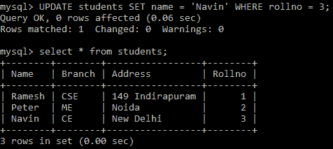

# Python MySQL -更新表数据

> 原文：<https://www.studytonight.com/python/python-mysql-update-data-in-table>

在本教程中，我们将学习如何在 Python 中**更新 MySQL 表数据**，在这里我们将使用 [`UPDATE` SQL 查询](/dbms/dml-update-command.php)和 [`WHERE`子句](/dbms/where-clause.php)。

`UPDATE` SQL 查询是**用来更新 MySQL 表中的任何记录**。

### Python MySQL `UPDATE`:语法

下面是 UPDATE 语句的基本语法:

```py
UPDATE table_name SET column_name = new_value WHERE condition
```

以上语法用于更新 MySQL 表中任何**特定行**。为了指定我们要更新哪一行数据，我们使用`WHERE`子句来提供要匹配的条件，同时寻找要更新的正确数据行。

## Python MySQL `UPDATE`表数据:示例

让我们通过更改学生的**姓名**来更新**学生**表中的记录(来自 [Python MySQL 创建表](/python/python-mysql-create-table)教程)，该学生的 **rollno** 是 **3** 。代码如下:

```py
import mysql.connector as mysql

db = mysql.connect(
    host = "localhost",
    user = "yourusername",
    passwd = "yourpassword",
    database = "studytonight"
)
cursor = db.cursor()
## defining the Query
query = "UPDATE students SET name = 'Navin' WHERE rollno = 3"
## executing the query
cursor.execute(query)
## final step is to commit to indicate the database 
## that we have changed the table data
db.commit()
```

为了检查**数据是否成功更新**，我们可以使用下面给出的代码检索学生表数据:

```py
import mysql.connector as mysql

db = mysql.connect(
    host = "localhost",
    user = "yourusername",
    passwd = "yourpassword",
    database = "studytonight"
)

cursor = db.cursor()
## defining the Query
query = "SELECT * FROM students"
## getting records from the table
cursor.execute(query)
## fetching all records from the 'cursor' object
records = cursor.fetchall()
## Showing the data
for record in records:
    print(record)
```

上面代码的输出是:

(' RaMEsh '，' CSE '，' 149 individuals '，1) ('Peter '，' me '，' Noida '，2) ('Navin '，' CE '，'新德里'，3)

以下是实际输出的快照:



在`SELECT`查询中，我们也可以使用`WHERE`子句只检索带有**rollino**3 或任何其他条件的行的数据。

* * *

* * *