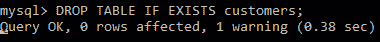

# Python MySQL -拖放表

> 原文：<https://www.studytonight.com/python/python-mysql-drop-table>

在本教程中，我们将学习**如何使用 Python 从数据库中删除 MySQL 表**或完全删除该表。

要完全**删除一个现有的表**(包括表数据和表本身)，使用`DROP TABLE` SQL 语句。

## Python MySQL `DROP TABLE`:示例

假设今晚在**研究**数据库中有一个名为**客户**的表。然后我们可以使用下面的代码删除该表:

```py
import mysql.connector as mysql

db = mysql.connect(
    host = "localhost",
    user = "yourusername",
    passwd = "yourpassword",
    database = "studytonight"
)

cursor = db.cursor()
## We have created another table in our database named customers  
## and now we are deleting it
sql = "DROP TABLE customers"

cursor.execute(sql)
```

如果上述代码执行无误，则表示名为**客户**的表被成功删除。

## Python MySQL -删除表(如果存在)

`IF EXISTS`关键字用于避免在试图删除不存在的表时可能出现的错误。

当我们使用`IF EXISTS`子句时，我们正在通知 SQL 引擎，如果给定的表名存在，那么删除它，如果它不存在，那么什么也不做。

```py
import mysql.connector as mysql

db = mysql.connect(
    host = "localhost",
    user = "yourusername",
    passwd = "yourpassword",
    database = "studytonight"
)

cursor = db.cursor()

sql = "DROP TABLE IF EXISTS customers"

cursor.execute(sql)
```

如果代码执行时没有出现错误，则意味着如果 customers 表存在，它将被删除。

以下是实际输出的快照:



因此，在本教程中，我们学习了如何使用 Python 删除 MySQL 表。当我们有一些应用创建一些临时表来存储一些数据，然后在处理之后删除这些表时，这很有用。

* * *

* * *