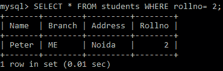

# Python MySQL——`WHERE`子句

> 原文：<https://www.studytonight.com/python/python-mysql-where-clause>

在本教程中，我们将学习**如何使用`WHERE`子句从提取的结果集中筛选行**，或者更新特定行，或者从 MySQL 表中删除特定行，以指定查找执行操作的数据记录/行的条件。

所以，`WHERE`子句只不过是向 SQL 引擎提供一个条件(或多个条件)的一种方式，它应用于查询结果集，以过滤出所需的数据记录。

## Python MySQL `WHERE`子句

我们已经在之前的教程中使用了`WHERE`子句:

*   [Python MySQL -更新表数据](/python/python-mysql-update-data-in-table)
*   [Python MySQL -删除表数据](/python/python-mysql-delete-data-from-table)

如果你想**根据某个条件**从表中选择数据，那么你可以在`SELECT`语句中使用`WHERE`子句。

*   `WHERE`子句主要用于从结果集中过滤行。

*   从 MySQL 表中获取、更新和删除数据对**很有帮助**。****

 **在`SELECT`语句中使用`WHERE`子句的语法如下:

```py
SELECT column_name 
FROM table_name 
WHERE condition;
```

上述语法在根据某些条件提取记录时非常有用。

## 使用`WHERE`子句

下面我们有一个例子，我们将从我们的**学生**表(来自 [Python MySQL 创建表](/python/python-mysql-create-table)教程)中获取具有 **rollno = 2** 的行:

```py
import mysql.connector as mysql
###First create a connection between mysql and python
db = mysql.connect(
    host = "localhost",
    user = "yourusername",
    passwd = "yourpassword",
    database = "studytonight"
)
# now create a cursor object on the connection object 
# created above by using cursor() method
cursor = db.cursor()

## defining the Query
query = "SELECT * FROM students WHERE rollno= 2"

## getting records from the table
cursor.execute(query)

## fetching all records from the 'cursor' object
records = cursor.fetchall()

## Showing the data
for record in records:
    print(record)
```

上述代码的输出将是:

('彼得'，'我'，'新娘'，' 2)

以下是实际输出的快照:



* * *

* * ***