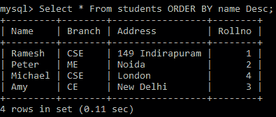

# Python MySQL——`ORDER BY`子句

> 原文：<https://www.studytonight.com/python/python-mysql-orderby-clause>

在本教程中，我们将学习**如何在 MySQL 中以任意顺序**(升序或降序)对结果进行排序。

MySQL 中的`ORDER BY`主要用于**的排序目的**。也就是说，在`ORDER BY`的帮助下，可以按照**上升**或**下降**的顺序对结果进行排序。

*   默认情况下`ORDER BY`语句会按照**升序**对结果进行排序，或者我们也可以使用`ASC`关键字。

*   为了按照**降序**对结果进行排序，将使用`DESC`关键字。

下面我们有一个**基本语法**以升序对结果进行排序，这是默认的:

```py
SELECT column_names FROM table_name ORDER BY column_name
```

## Python MySQL `ORDER BY`示例

下面我们有一个例子，我们将按照升序对结果进行排序。让我们看看下面给出的代码片段:

```py
import mysql.connector as mysql

db = mysql.connect(
    host = "localhost",
    user = "yourusername",
    passwd = "yourpassword",
    database = "studytonight"
)

cursor = db.cursor()
## defining the Query
query = "SELECT * FROM students ORDER BY name"

## getting records from the table
cursor.execute(query)

## fetching all records from the 'cursor' object
records = cursor.fetchall()

## Showing the data
for record in records:
    print(record)
```

上面的代码将以升序对名称进行排序，输出如下:

(《艾米》、《欧共体》、《新德里》，3)(《迈克尔》、《CSE》、《伦敦》，4)(《彼得》、《我》、《新娘》，2)(《拉麦什》、《CSE》、《149 印第安人》，1)

以下是实际输出的快照:


## Python MySQL〔t0〕

语法`ORDER BY COLUMN_NAME DESC`语句用于根据指定的列按降序对结果集进行排序。

下面给出了使用该语句的语法:

```py
SELECT column_names FROM table_name ORDER BY column_name DESC 
```

现在让我们使用带有`ORDER BY`子句的`DESC`关键字，按照**名称**列，按**降序对数据进行排序。让我们看看下面给出的代码:**

```py
import mysql.connector as mysql

db = mysql.connect(
    host = "localhost",
    user = "yourusername",
    passwd = "yourpassword",
    database = "studytonight"
)

cursor = db.cursor()
## defining the Query
query = "SELECT * FROM students ORDER BY name Desc"

## getting records from the table
cursor.execute(query)

## fetching all records from the 'cursor' object
records = cursor.fetchall()

## Showing the data
for record in records:
    print(record)
```

上述代码的输出将是:

(‘Ramesh’、‘CSE’、‘149 individuals’、‘1’、‘Peter’、‘me’、‘noida’、‘2’、‘Michael’、‘CSE’、‘London’、‘4’、‘Amy’、‘ce’、‘新德里’、‘3’

以下是实际输出的快照:



* * *

* * *