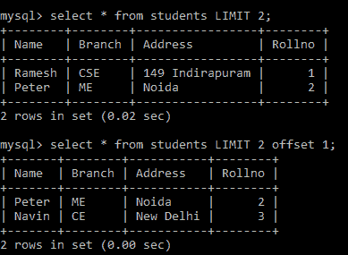

# Python MySQL -限制条款

> 原文：<https://www.studytonight.com/python/python-mysql-limit-clause>

在本教程中，我们将学习**如何借助 python 代码中添加到查询中的`LIMIT`子句来限制结果集中返回的行数**。

下面给出了使用该子句的语法:

```
SELECT {fieldname(s) | *} FROM tableName(s) [WHERE condition] LIMIT  N;
```

上述语法表明了以下情况:

*   **选择{ field name | * } FROM tableName**:此部分用于[选择我们希望在查询中返回的记录](/python/python-mysql-select-data-from-table)。

*   **【WHERE 条件】**:[WHERE 子句](/python/python-mysql-where-clause)是可选的，但是如果使用了，它会对结果集应用过滤器。

*   **LIMIT N** :用于限制结果中的记录。这里 **N** 从 0 开始，但是如果你将通过极限 0(那么它不返回任何记录)。如果您将通过 **6** ，那么它将返回输出中的开始 6 行。假设指定表中的记录小于 N，那么表中的所有记录都将返回到结果集中。

## Python MySQL `LIMIT`:示例

让我们仅从**学生**表中选择两行(来自 [Python MySQL 创建表](/python/python-mysql-create-table)教程)。其代码如下:

```
import mysql.connector as mysql

db = mysql.connect(
    host = "localhost",
    user = "yourusername",
    passwd = "yourpassword",
    database = "studytonight"
)

cursor = db.cursor()
cursor.execute("SELECT * FROM students LIMIT 2")

myresult = cursor.fetchall()

for x in myresult:
  print(x) 
```

上述代码的输出如下:

(' RaMEsh '，' CSE '，' 149 individuals '，1) ('Peter '，' me '，' noida '，' 2)

## 使用带`LIMIT`子句的`OFFSET`关键字

如果您不想从第一个位置开始，那么通过在`LIMIT`查询中使用`OFFSET`关键字，您可以从任何其他位置开始。让我们看看相同的代码示例:

```
import mysql.connector as mysql

db = mysql.connect(
    host = "localhost",
    user = "yourusername",
    passwd = "yourpassword",
    database = "studytonight"
)

cursor = db.cursor()

cursor.execute("SELECT * FROM students LIMIT 2 OFFSET 1")

myresult = cursor.fetchall()

for x in myresult:
  print(x) 
```

在上面的代码中 **LIMIT 2** 表示它将返回 2 行， **OFFSET 1** 结果集将从第 1 行开始，表示只返回第 2 行。因此，输出如下:

(彼得，我，新娘，2)(《纳文》，《欧共体》，《新德里》，3)

以下是实际输出的快照:



`OFFSET`关键字用于指定起点。例如，如果一个查询返回了 100 行数据，并且我们将`OFFSET`指定为 50，那么将返回从第 51 行开始直到第 100 行的数据。

* * *

* * *