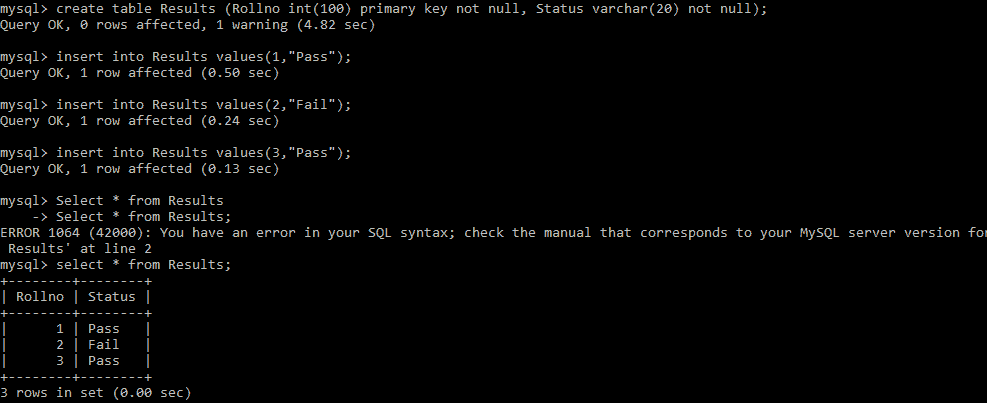
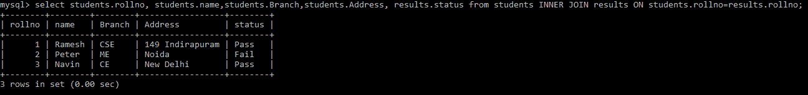
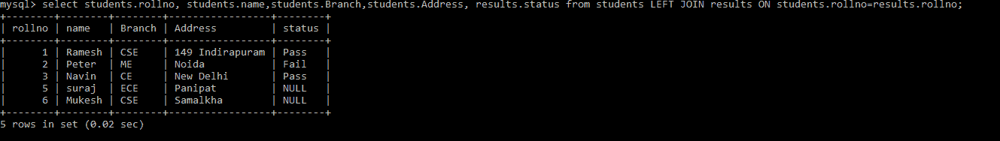
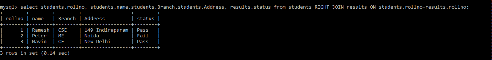

# Python MySQL——连接表

> 原文：<https://www.studytonight.com/python/python-mysql-table-join>

在本教程中，我们将学习如何在 Python 中连接两个或多个 MySQL 表。

为了将 MySQL 中的两个或多个表组合起来**，使用了`JOIN`语句。这里需要注意的一点是，在两个表**中必须有一个**公共列，该操作将基于该列执行。**

我们已经在【今晚 T2】学习数据库中创建了**学生**表(来自 [Python MySQL 创建表](/python/python-mysql-create-table)教程)。让我们创建另一个名为**结果**的表，之后我们将加入这两个表。

下面我们有代码来创建一个名为 results 的表。**成绩**和**学生**表都有一个共同的字段，那就是**罗诺**。



Yuo 可以直接运行查询，在 MySQL 命令行中创建新表。

## Python MySQL -连接两个表

下面我们有一个代码片段，其中我们将**基于列**rollino**连接两个名为**结果**和**学生**的表**:

```py
import mysql.connector as mysql

db = mysql.connect(
    host = "localhost",
    user = "yourusername",
    passwd = "yourpassword",
    database = "studytonight"
)

cursor = db.cursor()

sql = "SELECT students.rollno, students.name,students.Branch,students.Address, results.status from students INNER JOIN results ON students.rollno=results.rollno;"

cursor.execute(sql)

myresult = cursor.fetchall()

for x in myresult:
    print(x) 
```

上述代码的输出将是:

(1，“Ramesh”，“CSE”，“149 Indirapuram”，“Pass”)(2，“Peter”，“ME”，“Noida”，“Fail”)(3，“Navin”，“CE”，“New Delhi”，“Pass”)

上面的输出表明两个表都是连接的。

以下是实际输出的快照:



## Python MySQL -左连接

需要注意的是`INNER JOIN`(我们在上面的例子中讨论过)只在匹配时显示结果集中的行。

如果您想**从左侧表**中获取所有记录，即使没有**匹配**，也将使用`Left Join`。

让我们看看下面给出的左连接示例:

```py
import mysql.connector as mysql

db = mysql.connect(
    host = "localhost",
    user = "yourusername",
    passwd = "yourpassword",
    database = "studytonight"
)

cursor = db.cursor()

sql = "SELECT students.rollno, students.name,students.Branch,students.Address, results.status from students LEFT JOIN results ON students.rollno=results.rollno;"

cursor.execute(sql)

myresult = cursor.fetchall()

for x in myresult:
    print(x) 
```

上述代码的输出如下。让我们看看:

(1，“Ramesh”，“CSE”，“149 Indirapuram”，“Pass”)(2，“Peter”，“ME”，“Noida”，“Fail”)(3，“Navin”，“CE”，“New Delhi”，“Pass”)(5，“suraj”，“ECE”，“Panipat”，None) (6，“Mukesh”，“CSE”，“Samalkha”，None)

在上面的输出中，**5 号和 6 号辊的状态为“无”**，因为它们的结果是结果表中没有提到的**。但是由于我们已经应用了`LEFT JOIN`，所以即使没有匹配**，查询也会选择左表**中的所有行。**

以下是实际输出的快照:



## Python MySQL -右连接

如果你想从**右侧表格**中获取所有记录，即使没有**匹配**也会使用`Right Join`。

让我们看看下面给出的`Right Join`的例子。下面给出的代码将从右侧表中获取所有行。它不会返回那些带有**5 号和 6 号滚轮**的行:

```py
import mysql.connector as mysql

db = mysql.connect(
    host = "localhost",
    user = "yourusername",
    passwd = "yourpassword",
    database = "studytonight"
)

cursor = db.cursor()

sql = "SELECT students.rollno, students.name,students.Branch,students.Address, results.status from students RIGHT JOIN results ON students.rollno=results.rollno;"

cursor.execute(sql)

myresult = cursor.fetchall()

for x in myresult:
    print(x) 
```

上述代码的输出如下:

(1，“Ramesh”，“CSE”，“149 Indirapuram”，“Pass”)(2，“Peter”，“ME”，“Noida”，“Fail”)(3，“Navin”，“CE”，“New Delhi”，“Pass”)

以下是实际输出的快照:



至此，我们已经介绍了 Python MySQL 的所有基础知识。如果您必须开发一个应用，其中您希望有一个多表的数据库，您希望在其中存储数据并从表中检索数据，那么我们希望这些教程对您有所帮助。

* * *

* * *