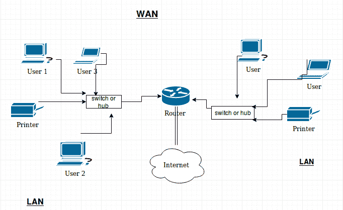

# 网络编程导论

> 原文：<https://www.studytonight.com/network-programming-in-python/introduction-to-network-programming>

欢迎伙计们！祝贺你迈出成为安全工程师的第一步。哦..安全工程师，但这到底意味着什么？

互联网每分钟在全球范围内传输数百万字节的数据。你知道这是怎么发生的吗？你点击一个链接，在几秒钟内下载一个数兆字节的文件，观看你最喜欢的视频，进行视频直播等等。这不是魔法！幕后有一些人，他们正在非常努力地工作，通过确保到达你这里的数据是不一致的和合法的，来高效和安全地实现这一切。他们被称为安全工程师。

你们中的一些人可能想知道在这里你们会学到什么。如果你学过编程，你一定想知道，好吧，我们知道编程！但是，该怎么处理呢？它的实际实现是什么。毕竟，没有人会给你一个数组，并要求你对它进行排序。没错。*通过编程解决的现实世界问题是不同的，也是复杂的。*

在这一系列的教程中，您将会遇到一些非常棒的编程实现，使用的不是别人，正是 **Python** 语言。

* * *

## 什么是网络？

[计算机联网](/computer-networks/)旨在研究和分析链接或联网在一起以交换信息和共享资源的各种计算设备或计算机系统之间的通信过程。因此，为了进行联网，您必须有一个网络。就像打电话一样，你必须有电话线。是不是很明显！所以，基本上有四种类型的计算机网络:

* * *

### 局域网

用于服务位于小地理空间的少数人，如学院、小组织等。这更像是一种对等的联系。

* * *

### 广域网

这种网络类型比局域网覆盖的面积更大，因为它们允许跨大地理区域的连接。它基本上将许多局域网连接在一起，不仅仅是对等共享。互联网就是广域网的一个例子。

下图将为您提供一个关于局域网和广域网的好主意:

### 城域网

城域网是一种计算机网络，它将用户与比局域网覆盖的区域大但比广域网覆盖的区域小的地理区域或地区的计算机资源相互连接起来。该术语源于其对城市中网络互连成一个更大网络的用法。

* * *

### 个人区域网

个人区域网(PAN)是一种计算机网络，用于计算机、电话、平板电脑和个人数字助理等设备之间的数据传输。pan 可用于个人设备之间的通信(人际通信)，或者连接到更高级别的网络和互联网(上行链路)，其中一个主设备承担互联网路由器的角色。

* * *

* * *