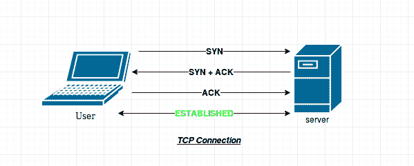
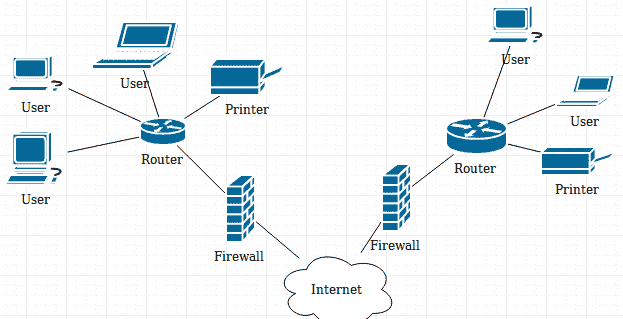

# 常见网络术语

> 原文：<https://www.studytonight.com/network-programming-in-python/networking-terminologies>

让我们快速浏览一下常用术语及其含义，这对网络编程非常重要。如果你已经知道了，那就快速浏览一遍，如果遗漏了什么，一定要告诉我们。

* * *

## 因特网协议

这些是管理互联网上数据流和数据格式的一套程序或规则。

让我们用一个简单的例子来理解这一点:假设有两个朋友 **A** 和 **B** 。如果**甲**想寄信给**乙**。他会怎么做？ **A** 会去邮局(一种通讯网络)，把信放在信封里，在邮局递交给 **B** 。现在，把信安全送到 **B** 是邮局的责任。现在假设 **A** 想要发送一个包含 20 页的脚本给 **B** 。因为有一个限制，一个信封最多只能装一页，所以 A 必须把所有 20 页放在单独的信封里，一页一页地寄出。现在如何保证邮局会按照预期的顺序投递信件？互联网协议来了。

我们将主要讨论互联网上的两个主要协议:

*   用户数据报协议
*   传输控制协议

* * *

### 用户数据报协议

UDP 是一种无连接协议。在该协议中，数据作为**数据报**通过互联网发送。在前面的例子中， *20 页可能指 20 个数据报*。让我们来看看 UDP 协议的一些属性。

*   **不可靠**:发送 UDP 报文时，无法知道是否会到达目的地；它可能会在路上迷路。在 UDP 中，没有确认、重传或超时的概念(如在 TCP 中)。
*   **未排序**:如果两条消息发送给同一个收件人，则无法预测消息到达的顺序。
*   **轻量级**:没有消息排序，没有跟踪连接等。因此，当所需的数据传输速率较高且可靠性不重要时，使用 UDP 消息。
*   **数据报**:数据包是单独发送的，只有在到达时才会进行完整性检查。

假设在上例中， **B** 接收所有页面，除了信封号 **13** 。然后他可以要求 **A** 重新发送信封号 **13** ，但是那么 **B** 如何知道，何时请求丢失的信封？有可能一旦 **B** 向 **A** 发出重发信封号 **13** 的请求，邮局就将丢失的信封送达。延迟交货的原因可能有很多。但是因为在 UDP 中，没有确认或重传的概念，因此，唯一的方法是等待，然后再次请求丢失的数据报。

所以我们需要一个更好的方法来确保 **B** 正确接收所有数据。幸运的是，在计算机网络中， **UDP** 不是在计算机之间发送数据的唯一协议。

* * *

### 传输控制协议

在 TCP 中有一个**握手**的概念。那么，什么是握手？这是一种确保感兴趣的主机之间已经建立连接的方法，因此可以启动数据传输。

简单来说，当你给某人打电话时，你首先说**“你好”**，作为回报，这个人回复一句**“你好”**。这确保了双方之间的连接已经建立，并且现在可以开始数据(在这种情况下是语音)传输。毫无疑问，这是握手最简单的例子。

与 UDP 不同，TCP 协议要求您首先建立连接。因此，如果 **A** 要使用 TCP 协议向 **B** 发送一封信，他必须首先与 **B** 建立连接。一旦建立连接， **A** 就可以发送第一个信封，并等待 **B** 确认他已经收到了。一旦 **A** 收到 **B** 确认信封 **1** 已安全收到， **A** 即可发送信封 **2** 。重复这个过程，直到 **A** 告诉 **B** 他已经发完了所有的信封。

根据上面的例子，我们可以确定 TCP 的属性:

*   **可靠** : TCP 管理消息确认、重传和超时。多次尝试传递消息。如果它在途中丢失，服务器将重新请求丢失的部分。
*   **有序**:消息按照预定的特定顺序传递。
*   **重量级**:在发送任何用户数据之前，TCP 需要三个数据包来建立套接字连接。三包分别是:`SYN`、`SYN+ACK`、`ACK`。

* * *

## IP 地址和端口

**IP 地址**是有助于在互联网上唯一识别设备的地址，**端口**是操作系统中通信的端点。迷茫！让我们试着让它简单易懂。

在上例中 **A** 给 **B** 发了一封信。 **A** 需要知道 **B** 的邮政地址才能成功投递包裹。这个邮政地址是独一无二的，因此邮递员成功地投递了这封信。 **IP 地址类似邮政地址**。现在，假设 **B** 有 5 个房间，每个房间都有一个 **B** 的亲戚。 **B** 的一个亲戚点了一个披萨。现在，当送披萨的男孩到达给定的地址时，他怎么知道 5 个亲戚中谁点了披萨？因此，为了唯一识别订购比萨饼的人，送货员需要房间号。这个**房间号是计算机网络中的端口号**。

一个系统可能运行数千个服务，但要唯一识别系统上的服务，应用程序需要一个端口号。一个系统上总共有**0–65535**个端口。

端口号有时也出现在网络或其他统一资源定位符(URL)中。默认情况下，HTTP 使用端口`80`，HTTPS 使用端口`443`，但是像*http://www.example.com:8080/path/*这样的网址指定网络浏览器改为连接到 HTTP 服务器的端口`8080`。

一些常见的端口有:

*   `22`:安全壳(SSH)
*   `23`:远程登录服务
*   `25`:简单邮件传输协议(SMTP)
*   `53`:域名系统(DNS)服务
*   `80`:万维网中使用的超文本传输协议(HTTP)

现在，接下来是一些关于 IP 地址的细节。IP 地址有两种类型:

1.  **私有 IP 地址**:范围从(**192 . 168 . 0 . 0**—**192 . 168 . 255 . 255**)、(**172 . 16 . 0 . 0**—**172 . 31 . 255 . 255**)或(**10 . 0 . 0 . 0 . 0**—**10 . 255 . 25**
2.  **公共 IP 地址**:公共 IP 地址是您的家庭或企业路由器从您的 ISP(互联网服务提供商)接收的 IP 地址。

* * *

## 防火墙

防火墙根据预定义的安全规则监控传入和传出的网络流量，如扫描数字签名、检查有效的文件格式等。它在可信、安全的内部网络和另一个被认为不安全或不可信的外部网络(如互联网)之间建立了屏障。

* * *

## 为什么选择 Python 进行网络编程？

本课程使用 Python 有几个原因。python 的简单性使其成为最强大的语言。Python 在语法上最容易实现。

此外，使用 python 几乎可以做任何事情。哦..几乎所有的东西，我们能用 python 做一个网站吗？我们能用 python 做人脸检测应用吗？我们可以使用 python 制作自己的个人助理吗？我们能用 python 做一个渗透测试工具吗？

以上所有问题的答案都是“是”！

python 提供的第三方库支持使它变得无限。对于第三方库也有适当的文档，因此在您的应用程序中使用它们变得更加容易。

最后，python 足够强大，可以制作像 Quora 这样的网站，并为谷歌搜索引擎提供主干，所以没错，python 是网络编程的完美选择。

* * *

* * *