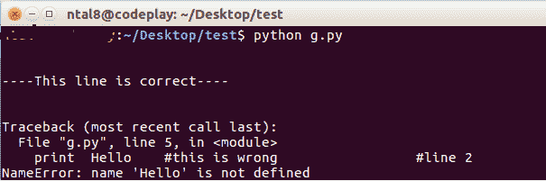
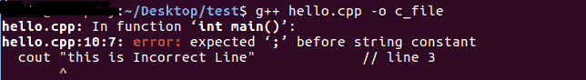
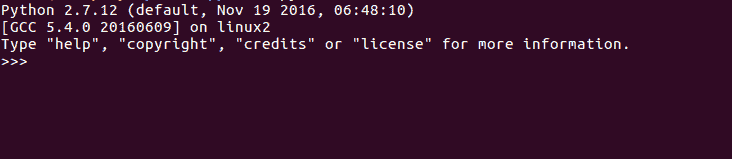
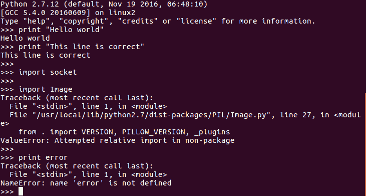

# 解释和交互式 Python

> 原文：<https://www.studytonight.com/network-programming-in-python/interpreted-and-interactive-python>

让我们从理解 python 的解释本质开始。

* * *

## 解释 Python

与 C/C++等不同，Python 是一种**解释的面向对象编程语言**。解释意味着每次运行程序时，解释器都会检查代码中的错误，然后将指令解释成机器可读的字节码。

解释器是计算机语言的翻译器，它将给定的代码逐行翻译成机器可读的字节码。如果遇到任何错误，它会停止转换，直到错误被修复。不像 C 语言，那是一种**编译的编程语言**。编译器一次性翻译全部代码，而不是逐行翻译。这就是为什么在 C 语言中，所有的错误都只在编译时列出。

```py
# Demonstrating interpreted python

print "\n\n----This line is correct----\n\n"   #line1
print Hello     #this is wrong                 #line2
```



在上图中，您可以看到**第 1 行**在语法上是正确的，因此成功执行。然而，在**第 2 行**中，我们有一个语法错误。因此，解释器在**第 2 行**处停止执行上述脚本。这在编译编程语言的情况下是无效的。

下图是一个 C++程序，虽然**第 1 行**和**第 2 行**是正确的，但是由于**第 3 行**的错误，程序报告了一个错误。这就是解释语言和编译语言的基本**区别。**

```py
// Demonstrating Compiled language

#include<iostream>
using namespace std;
int main()
{
        cout<
```



* * *

## 交互式 Python

Python 是交互式的。当输入 Python 语句，并在后面加上 Return 键(如果合适)时，结果将立即打印在屏幕的下一行。这在调试过程中特别有利。在交互操作模式下，Python 的使用方式类似于 Unix 命令行或终端。

交互式 Python 外壳看起来像:



交互式 Python 对调试非常有帮助。如果合适，它只返回`>>>`提示或语句的相应输出，如果语句不正确，则返回**错误**。这样，如果您有任何疑问，如:语法是否正确，您正在导入的模块是否存在或类似的问题，您可以使用 Python 交互模式在几秒钟内确定。

交互式 python 的图示如下所示:



* * *

* * *