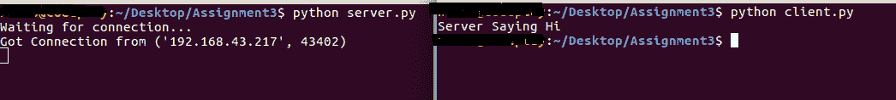
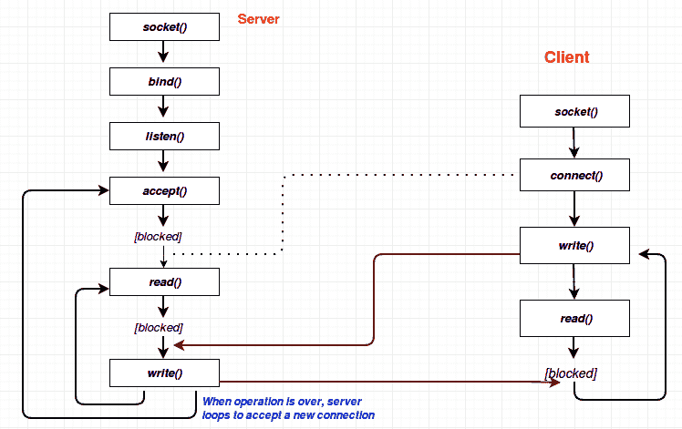

# 使用 TCP 套接字

> 原文：<https://www.studytonight.com/network-programming-in-python/working-with-tcp-sockets>

到现在为止，你们一定很熟悉[之前的教程](socket-methods)中描述的 socket 方法。现在我们将在一个简单的**客户端-服务器程序**中使用这些方法。

## 简单服务器程序

```py
#!/usr/bin/python

#This is tcp_server.py script

import socket			                #line 1: Import socket module

s = socket.socket()		                #line 2: create a socket object
host = socket.gethostname()	            #line 3: Get current machine name
port = 9999			                    #line 4: Get port number for connection

s.bind((host,port))		                #line 5: bind with the address

print "Waiting for connection..."	
s.listen(5)			                    #line 6: listen for connections

while True:
	conn,addr = s.accept()	            #line 7: connect and accept from client
	print 'Got Connection from', addr
	conn.send('Server Saying Hi')
	conn.close()		                #line 8: Close the connection
```

这个脚本现在什么也做不了。它等待客户端在指定的端口连接。如果我们现在在没有客户端的情况下运行这个脚本，它将等待连接，


同样，您访问的每个网站都有一个托管它的服务器，它总是等待客户端连接。现在让我们创建一个`client.py`程序，并尝试与我们的`server.py`连接。

* * *

## 简单客户端程序

下面是`client.py`程序。客户端尝试连接到服务器的端口`9999`(定义良好的端口)。代码行`s.connect((host, port))`打开到端口`9999`上主机名的 TCP 连接。

```py
#!/usr/bin/python

#This is tcp_client.py script

import socket			

s = socket.socket()		
host = socket.gethostname()	        # Get current machine name
port = 9999			                # Client wants to connect to server's
				                    # port number 9999
s.connect((host,port))
print s.recv(1024)		            # 1024 is bufsize or max amount 
				                    # of data to be received at once
s.close()
```

现在，先运行`server.py`脚本(如果你还没有的话)，然后运行`client.py`脚本。如果一切顺利，您将看到如下输出:



**注**:这里我们是在同一台机器上运行客户端和服务器，但是现实生活场景肯定和这个不一样，但是很相似。

请注意，执行后终止，但`server.py`仍在运行。这也是真实场景中发生的事情。完成您的请求后，今夜研究服务器将继续全天候运行，为其他用户提供服务。

执行`client.py`后，服务器显示:**从(' 192.168.43，217 '，43402)** 获得连接。这里的端口`43402`是随机的，或者是操作系统分配给客户端的**临时端口**。

* * *

## 程序流程图



* * *

* * *