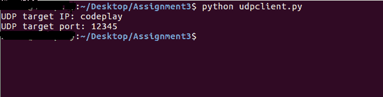
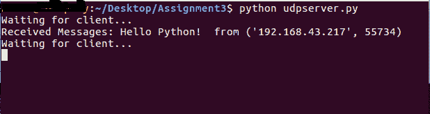
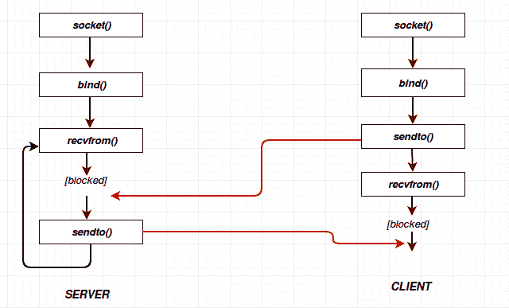

# 使用 UDP 套接字

> 原文：<https://www.studytonight.com/network-programming-in-python/working-with-udp-sockets>

嗯，在[插座的基本教程](socket-methods)中，你可能有一个困惑，我们将插座定义为:

```
S = socket.socket(socket_family, socket_type, protocol = 0)
```

但是，在[上一篇关于 TCP 套接字的教程](working-with-tcp-sockets)中，我们仅仅通过编写`S=socket.socket()`来定义 TCP 套接字，也就是说没有提供 **socket_family** 和 **socket_type** 。如果不提**插座 _ 家族**和**插座 _ 类型**，那么默认为`TCP`。所以，如果我们想创建一个 UDP 套接字，我们必须明确指定 **socket_family** 和 **socket_type** 。

对于 UDP 套接字，我们定义:

```
s = socket.socket(socket.AF_INET, socket.SOCK_DGRAM)
```

并且，如果您明确想要定义一个 TCP 套接字:

```
s = socket.socket(socket.AF_INET, socket.SOCK_STREAM)
```

* * *

## 简单的 UDP 服务器程序

这是`udpserver.py`的剧本:

```
#!usr/bin/python

import socket

sock = socket.socket(socket.AF_INET,socket.SOCK_DGRAM)      # For UDP

udp_host = socket.gethostname()		        # Host IP
udp_port = 12345			                # specified port to connect

#print type(sock) ============> 'type' can be used to see type 
				# of any variable ('sock' here)

sock.bind((udp_host,udp_port))

while True:
	print "Waiting for client..."
	data,addr = sock.recvfrom(1024)	        #receive data from client
	print "Received Messages:",data," from",addr
```

上述脚本的输出如下。保持运行，然后启动`client.py`模块。


* * *

## 简单 UDP 客户端

这是`udpclient.py`的剧本:

```
#!usr/bin/python

import socket

sock = socket.socket(socket.AF_INET,socket.SOCK_DGRAM)      # For UDP

udp_host = socket.gethostname()		# Host IP
udp_port = 12345			        # specified port to connect

msg = "Hello Python!"
print "UDP target IP:", udp_host
print "UDP target Port:", udp_port

sock.sendto(msg,(udp_host,udp_port))		# Sending message to UDP server
```

我们的`udpserver.py`已经启动并运行，所以现在我们尝试运行`udpclient.py`脚本，



以下是客户端发送请求后我们的服务器发生的情况:



* * *

## 程序流程图



因此，在本教程和最后一个教程中，我们已经学习了如何使用 TCP 套接字和 UDP 套接字建立成功的客户端-服务器连接。

* * *

* * *