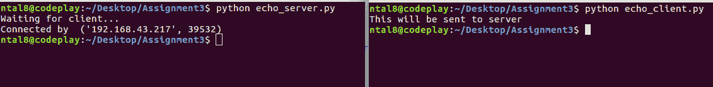
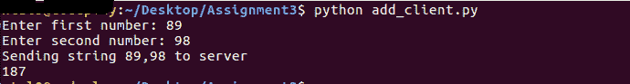

# 通过 TCP 套接字处理接收的客户端数据

> 原文：<https://www.studytonight.com/network-programming-in-python/handling-received-data>

现在我们将有一个例子，其中客户端向服务器发送一些数据，服务器按照指示处理数据。我们将看到两个不同的用例:

*   回应客户端-服务器程序
*   通过添加来处理接收到的数据

* * *

## 简单的客户端-服务器程序

在这个程序中，服务器只是回应从客户端接收到的数据。你一定见过一些门户网站，当你访问它们的页面时，它们会回显(打印)你的详细信息。首先，我们创建服务器。我们从创建一个 **TCP 套接字对象**开始。我们将套接字绑定到本地机器上的给定端口。在监听阶段，我们使用`listen()`方法的 backlog 参数确保监听队列中的多个客户端。最后，我们等待客户端连接并向服务器发送一些数据。当接收到数据时，服务器将数据回传给客户端。

**echo_server.py**

```py
#!usr/bin/python

import socket
host = socket.gethostname()
port = 12345
s = socket.socket()		# TCP socket object
s.bind((host,port))
s.listen(5)

print "Waiting for client..."
conn,addr = s.accept()	        # Accept connection when client connects
print "Connected by ", addr

while True:
	data = conn.recv(1024)	    # Receive client data
	if not data: break	        # exit from loop if no data
	conn.sendall(data)	        # Send the received data back to client
conn.close()
```

上面的代码执行如下:


echo _ client . py

```py
#!usr/bin/python

import socket
host = socket.gethostname()
port = 12345
s = socket.socket()		# TCP socket object

s.connect((host,port))

s.sendall('This will be sent to server')    # Send This message to server

data = s.recv(1024)	    # Now, receive the echoed
					    # data from server

print data				# Print received(echoed) data
s.close()				# close the connection
```

现在，由于服务器已经启动并运行，我们应该运行我们的`echo_client.py`



* * *

## 对客户端-服务器程序中的数据执行操作

在这个程序中，我们将向服务器发送信息，服务器将汇总数据并发回给客户端。但是，这有什么新的？

你会看到，当我们发送两个数字到服务器进行加法运算时，我们不是以两个整数的形式发送，而是以字符串的形式发送数据。比方说，我们想加上 4 和 5，所以我们将 4 和 5 作为一个字符串`'4,5'`发送。注意 4 到 5 之间的逗号`,`。这充当两个整数的分隔符。

在服务器上，当我们接收到字符串`'4,5'`时，我们将从字符串中提取整数，将它们相加，然后通过将相加结果转换成字符串将结果发送回客户端。

**add_server.py**

```py
#!usr/bin/python

import socket
host = socket.gethostname()
port = 12345
s = socket.socket()		    # TCP socket object
s.bind((host,port))

s.listen(5)

conn, addr = s.accept()
print "Connected by ", addr
while True:
	data=conn.recv(1024)
	# Split the received string using ','
	# as separator and store in list 'd'
	d = data.split(",")	    

	# add the content after converting to 'int'
	data_add = int(d[0]) +int(d[1]) 

	conn.sendall(str(data_add))	    # Send added data as string
					                # String conversion is MUST!
conn.close()
```

**add_client.py**

```py
#!usr/bin/python

import socket

host = socket.gethostname()
port = 12345

a = str(raw_input('Enter first number: '))	# Enter the numbers
b = str(raw_input('Enter second number: '))	# to be added
c = a+','+b					# Generate a string from numbers

print "Sending string {0} to server" .format(c)

s = socket.socket()
s.connect((host,port))

s.sendall(c)				# Send string 'c' to server
data = s.recv(1024)			# receive server response
print int(data)				# convert received dat to 'int'

s.close()					#Close the Connection
```

现在，先运行`add_server.py`，然后运行`add_client.py`

**<u>输出:</u>**



* * *

* * *