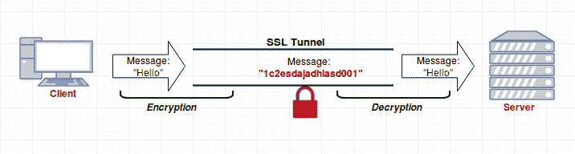
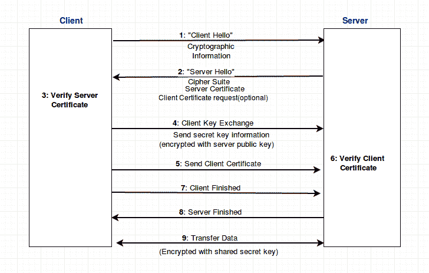

# 通过 TSL/SSL 保护套接字

> 原文：<https://www.studytonight.com/network-programming-in-python/securing-sockets>

在本教程中，我们将了解通过 TSL/SSL 保护套接字的概念。

* * *

## TSL/SSL

在深入 **TSL** 和 **SSL** 之前，首先要了解什么是**加密**。根据维基百科，*“加密是以只有授权方才能访问的方式对消息或信息进行编码的过程。在加密方案中，预期的信息或消息(称为明文)使用加密算法进行加密，生成只有解密后才能读取的密文。”*

> *加密是确保报文/数据机密性所必需的。*

**TLS(传输层安全性)**和 **SSL(安全套接字层)**是在数据通过不安全网络发送的情况下，在应用程序和服务器之间提供数据加密和身份验证的协议。

SSL 和 TLS 这两个术语经常互换使用，但其中一个实际上是另一个的前身——**SSL 3.0**是 **TLS 1.0** 的基础，因此，后者有时被称为 **SSL 3.1** 。

* * *

## SSL 握手

要进行 SSL/TLS 握手，系统管理员必须具备:

*   **私钥**:用于数据加密。
*   **证书**:保证委托人真实性。

虽然 SSL 握手有点复杂。我们将用最简单的方式来解释它。

* * *

* * *