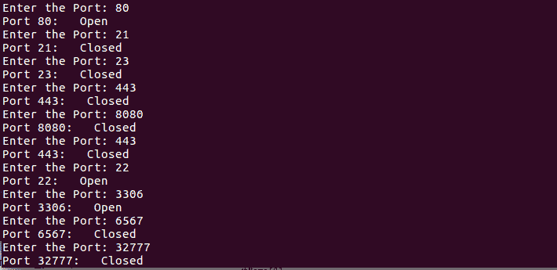

# 使用套接字构建自定义端口扫描器

> 原文：<https://www.studytonight.com/network-programming-in-python/building-a-port-scanner>

到目前为止，你一定已经对套接字有了足够的了解。现在，是时候从我们目前所学的一些实际应用开始了。从这一课开始，我们将强调使用 Python 的网络安全。

* * *

## 什么是端口扫描器？

嗯，考虑一种情况，你必须进入平房。你会怎么做？显而易见的答案是寻找通向平房的门。如果门被锁上了怎么办？嗯，在这种情况下，你将扫描房子的每一个其他的门和窗户，你可能会找到进入房子的路。

现在，如果你还记得本系列第二篇教程中关于端口的内容，你可能还记得端口就像系统中的门/窗。因此，进入系统的基本步骤是扫描系统的开放端口。因此，总是建议关闭系统(服务器)不必要的端口，以避免任何意外发生。对于**网络服务器**端口`80`默认为打开，用于 HTTP 请求和响应。

在本课中，我们将学习如何制作一个初级端口扫描仪，使用它可以扫描任何 web 服务的开放端口。

**port_scanner.py**

```py
#!usr/bin/python

#port_scanner.py

import socket

t_host = str(raw_input("Enter the host to be scanned: "))   # Target Host, www.example.com
t_ip = socket.gethostbyname(t_host)     # Resolve t_host to IPv4 address

print t_ip      # Print the IP address

while 1:
	t_port = int(raw_input("Enter the port: "))	   # Enter the port to be scanned

	try:
		sock = socket.socket()			
		res = sock.connect((t_ip, t_port))
		print "Port {}: Open" .format(t_port)
		sock.close()
	except:
		print "Port {}: Closed" .format(t_port)

print "Port Scanning complete"
```

当你运行上述程序时，它会提示你输入一个**主机名**(www.example.com)，然后它会继续询问你想要扫描的端口号。

> *要终止程序，请按`Ctrl + C`。*

**输出:**



* * *

* * *