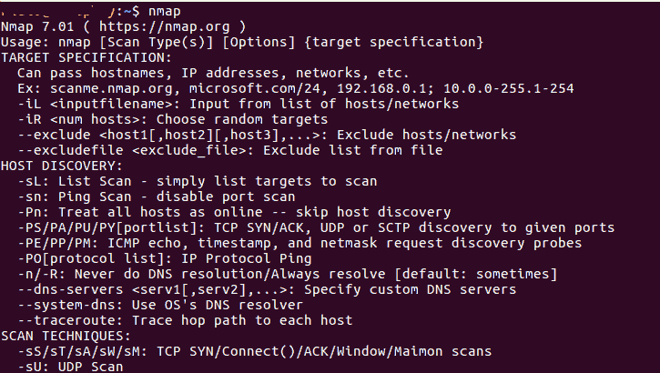
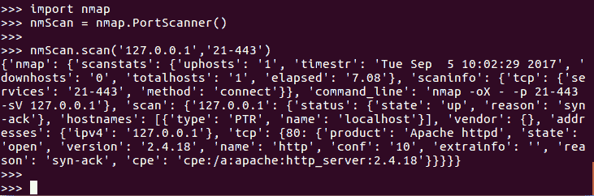
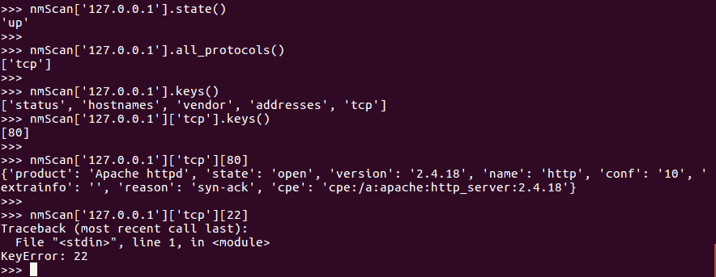

# 在 Python 中使用 Nmap 端口扫描器

> 原文：<https://www.studytonight.com/network-programming-in-python/integrating-port-scanner-with-nmap>

在本教程中，我们将学习如何将 Nmap 安全扫描仪与我们的 Post 扫描仪程序集成。

* * *

## 什么是 Nmap？

**Nmap(Network Mapper)** 是一款安全扫描器，最初由戈登·里昂(也以笔名 Fyodor Vaskovich 为人所知)编写，用于发现计算机网络上的主机和服务，从而构建网络地图。为了实现其目标，Nmap 向目标主机发送特制的数据包，然后分析它们的响应。

一些有用的 Nmap 功能包括:

*   **主机发现**:这使得能够识别任何网络上的主机。例如，列出响应 TCP 和/或 ICMP 请求或打开特定**端口**的主机。
*   **端口扫描**:枚举(逐一计数并列出)目标主机上所有打开的端口。
*   **版本检测**:查询远程设备上的网络服务，确定应用名称和版本号。
*   **OS 检测**:确定网络设备的操作系统和硬件特性。
*   **与目标的可脚本化交互**:使用 Nmap 脚本引擎(NSE)和 Lua 编程语言，我们可以轻松编写 sripts 在网络设备上执行操作。

虽然 Nmap 是命令行界面，但是你可以下载并安装 Nmap 的 GUI 界面，称为 **zenmap** 。



以上是命令行的截图，当你运行`nmap`命令时，列出了目标规范和主机发现、扫描技术等所有可用选项，以供你参考。如果您想在机器上安装 nmap，那么:

*   运行，`sudo apt-get install nmap`为 Linux。
*   对于 Windows 和 Mac OS X，下载并安装 Nmap:[https://nmap.org/download.html](https://nmap.org/download.html)

我们在[上一篇教程](building-a-port-scanner)中编写的端口扫描器提供了一个执行 TCP 连接扫描的快速脚本。这是非常有限的，因为我们可能需要执行额外扫描类型的能力，例如由 Nmap 工具包提供的`ACK`、`RST`、`FIN`或`SYN-ACK`扫描。Nmap 提供了相当广泛的功能。这就引出了一个问题，为什么不直接使用 Nmap 呢？为什么要费心为端口扫描器编写脚本？

Nmap 是用**C****LUA**编程语言编写的，很容易集成到 Python 中。Nmap 产生基于 XML 的输出，这为我们提供了从 Python 脚本中利用 Nmap 全部功能的能力。所以我们的端口扫描器脚本只是外壳，在里面我们现在将使用 Nmap。

因此，在我们开始使用 nmap 之前，让我们首先安装 Nmap 模块:

*   使用命令，`pip install python-nmap`
*   或者从[这里](http://xael.org/pages/python-nmap-en.html)下载软件包安装。

* * *

## 在 Python 脚本中使用 Nmap

以下是可以用来成功扫描所有端口并以 JSON 格式返回结果的命令。

```py
>>> import nmap
>>> nmScan = nmap.PortScanner()
>>> 
>>> nmScan.scan('127.0.0.1', '21-443')
```



我们都知道，`import nmap`是干什么的，就是把`nmap`模块导入到我们的 python 脚本中。然后我们初始化 Nmap 端口扫描器来扫描本地网络上的端口。

第三行，即`nmScan.scan('127.0.0.1', '21-443')`返回在本地家庭(127.0.0.1)网络上执行的 21 到 443 之间端口号的扫描字典。您还可以提供任何远程服务器的 IP 地址，以扫描可用的端口。

如果你想使用命令行运行 Nmap 命令，你可以通过使用`command_line()`方法很容易地得到相当于`nmScan.scan('127.0.0.1', '22-443')`行代码的命令行，该方法读取`scan`方法调用并生成一个相当于命令行运行的命令。

```py
>>> import nmap
>>> nmScan = nmap.PortScanner()
>>> 
>>> nmScan.scan('127.0.0.1', '21-443')
>>> nmScan.command_line()
```

nmap -oX - -p 21-443 -sV 127.0.0.1


* * *

### 更多 Nmap 方法

现在，让我们看看更多的命令:

```py
>>> nmScan.scaninfo()
{'tcp': {'services': '22-443', 'method': 'connect'}}

>>> nmScan.all_hosts()
['127.0.0.1']

>>> nmScan['127.0.0.1'].hostname()
'localhost'

>>> nmScan['127.0.0.1'].state()
'up'

>>> nmScan['127.0.0.1'].all_protocols()
['tcp']

>>> nmScan['127.0.0.1']['tcp'].keys()
[80, 25, 443, 22, 111]

>>> nmScan['127.0.0.1'].has_tcp(22)
True

>>> nmScan['127.0.0.1'].has_tcp(23)
False

>>> nmScan['127.0.0.1']['tcp'][22]
{'state': 'open', 'reason': 'syn-ack', 'name': 'ssh'}

>>> nmScan['127.0.0.1'].tcp(22)
{'state': 'open', 'reason': 'syn-ack', 'name': 'ssh'}
```

让我们谈谈上面使用的几种方法。方法`all_protocols()`返回当前被扫描网络的协议。方法`keys()`返回指定范围内所有可用的活动端口。

当我们在本地计算机上使用`keys()`方法时，只返回端口`80`，因为指定范围内没有其他端口处于活动状态。



**注意:**在最后一个命令中出现错误。这是因为在命令`nmScan['127.0.0.1']['tcp'].keys()`中，获得的唯一键值是[80]，而在最后一行中，我们指定了[22]。

下面我们有一个简单的程序，用于扫描和列出给定主机的端口:

```py
import nmap
# initialize the port scanner
nmScan = nmap.PortScanner()

# scan localhost for ports in range 21-443
nmScan.scan('127.0.0.1', '21-443')

# run a loop to print all the found result about the ports
for host in nmScan.all_hosts():
     print('Host : %s (%s)' % (host, nmScan[host].hostname()))
     print('State : %s' % nmScan[host].state())
     for proto in nmScan[host].all_protocols():
         print('----------')
         print('Protocol : %s' % proto)

         lport = nmScan[host][proto].keys()
         lport.sort()
         for port in lport:
             print ('port : %s\tstate : %s' % (port, nmScan[host][proto][port]['state'])
```

主机:127.0.0.1 (localhost)状态:up - Protocol : tcp 端口:22 状态:开放端口:25 状态:开放端口:80 状态:开放端口:111 状态:开放端口:443 状态:开放

* * *

* * *