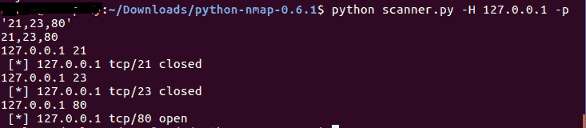

# 从命令行输入的 Nmap 端口扫描脚本

> 原文：<https://www.studytonight.com/network-programming-in-python/input-from-command-line>

在本教程中，我们将学习在运行脚本时从命令行获取输入，而不是硬编码脚本中的值。我们将研究从命令行获取输入的两种不同方式:

*   使用**参数解析**
*   使用**选择**

* * *

## 使用`argparse`解析参数

**scan_nmap.py**

```
#!usr/bin/evn python
#Integrating nmap

import nmap
import argparse

# defining nmap scan function with arguments
# tgtHost will hold the host value and tgtPort will hold the port value
def nmapScan(tgtHost, tgtPort):
    nmscan = nmap.PortScanner()
    nmscan.scan(tgtHost, tgtPort)
    state = nmscan[tgt_host]['tcp'][int(tgtPort)]['state']
    print " [*] " + tgtHost + " tcp/"+tgtPort + " "+state

def main():
    # setup argument parsing
    parser = argparse.ArgumentParser(description='Command line Argument passing example')

    # reading and storing the value for host
    parser.add_argument('--host', action = "store", dest = "host",
    required=True)

    # reading and storing the value for port
    parser.add_argument('--port', action = "store", dest = "port", 
    type = int, required = True)

    given_args = parser.parse_args()
    tgtHost = given_args.host
    tgtPort = given_args.port

    #check if host and port values are not null
    if (tgtHost == None) | (tgtPort == None):
        print parser.usage
        exit(0)
    else:
        print "Scanning: " + tgtHost + "-" + str(tgtPort)
        # calling the nmapScan function with the provided values
        nmapScan(tgtHost, str(tgtPort))

if __name__ == '__main__':
    main()
```

在上面的脚本中，`nmapScan`是一个简单的方法，它接受两个参数，主机名/地址和您想要扫描的端口号。

在`main()`函数中，我们使用`argparse`来解析脚本运行时提供的参数。`add_argument()`解析参数并保存它们的值。

运行此程序时，您一次只能指定一个端口，如:

```
python scan_nmap.py  --host=127.0.0.1  --port=21
```

[*] 127.0.0.1 tcp/21 关闭

因此，如果您想要扫描特定主机的 10 个端口，您需要运行该脚本 10 次。我们不想那样！所以，现在我们将看到一种不同的方式来实现这一点。在这里，我们将端口作为一个由逗号分隔的字符串传递，如**‘21，80，23’**(带引号)。

* * *

## 使用`optparse`解析参数

**扫描仪. py**

```
#!usr/bin/evn python
#Integrating nmap

import nmap
import optparse

# defining nmap scan function with arguments
# tgtHost will hold the host value and tgtPort will hold the port value
def nmapScan(tgtHost, tgtPort):
    nmscan = nmap.PortScanner()
    nmscan.scan(tgtHost, tgtPort)
    state = nmscan[tgt_host]['tcp'][int(tgtPort)]['state']
    print " [*] " + tgtHost + " tcp/"+tgtPort + " "+state

def main():
    # printing Help to inform How to use this script
    parser = optparse.OptionParser('Script Usage:'+'-H <target host> -p <target port>')

    parser.add_option('-H', dest='tgt_Host', type='string', 
    help='specify target host')

    parser.add_option('-p', dest='tgtPort', type='string', 
    help='specify target port[s] separated by comma')

    (options,args) = parser.parse_args()
    tgtHost = options.tgtHost
    tgtPorts = str(options.tgtPort)

    print tgtPorts

    if (tgtHost == None) | (tgtPorts[0] == None):
        print parser.usage
        exit(0)

    ports = tgtPorts.strip("'").split(',')

    for tgtPort in ports:
        print tgtHost+ " " +tgtPort
        nmapScan(tgtHost, tgtPort)

if __name__ == '__main__':
        main()
```

您会看到`optparse`和`argparse`在脚本运行时传递参数的风格方面也有所不同。

除此之外，我们可以使用`argparse`将逗号分隔的端口列表作为输入，然后运行`for`循环来扫描每个端口。

但是我们在这里的动机是给你提供两种不同的方式，去做同样的事情。结果现在知道了，怎么用`optparse`和`argparse`。使用这些，您甚至可以为各种操作编写简单的 python 脚本。

要运行上述脚本:

```
python scanner.py  -H 127.0.0.1  -p '21,23,80'
```

[*] 127.0.0.1 tcp/21 关闭[*] 127.0.0.1 tcp/23 关闭[*] 127.0.0.1 tcp/80 打开



* * *

* * *