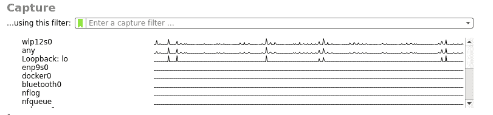
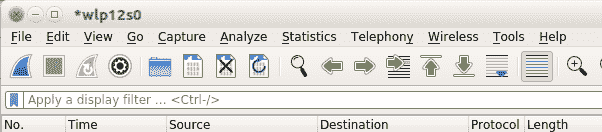
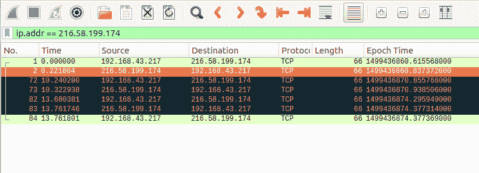
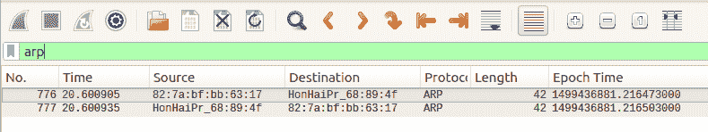

# Wireshark 数据包分析

> 原文：<https://www.studytonight.com/network-programming-in-python/using-wireshark>

在我们开始使用 wireshark 之前，让我们先安装它。为 Linux 平台安装 wireshark 超级容易。只需运行以下命令:

```py
sudo apt-get install wireshark
```

对于 Windows 用户，你需要从[这里](https://www.wireshark.org/download.html)下载 wireshark，然后安装。

现在，一旦我们成功安装了 wireshark，我们将使用它。启动 Wireshark 后，首先您需要选择您想要捕获无线、以太网等流量的接口。



如果您不确定您的界面，只需在命令行中键入`ifconfig`(【窗口的 T1】)并查看您当前正在使用什么界面来浏览网页。选择界面后，点击工具栏上的**采集**数据包按钮。



现在，当您单击捕获按钮时，您将在 Wireshark 仪表板中看到随机的数据泛滥。这是你的网络流量。过滤流量的一些基本方法:

*   要过滤来自任何特定 IP 地址的流量，请在**中键入:`ip.addr == 'xxx.xx.xx.xx'`应用显示过滤器**字段。
*   要过滤特定协议的流量，如`TCP`、`UDP`、`SMTP`、`ARP`、`DNS`请求等，只需在应用显示过滤器字段中键入协议名称。

### 按 IP 地址过滤



### 按协议名称过滤



* * *

## 将捕获的数据保存在 Wireshark 上

您可以使用以下步骤保存捕获的交通数据:

*   点击**停止**按钮，停止数据包捕获。
*   转到，**文件→另存为→文件名. pcap**

**注意**:本教程以`.pcap`格式保存文件。

* * *

* * *