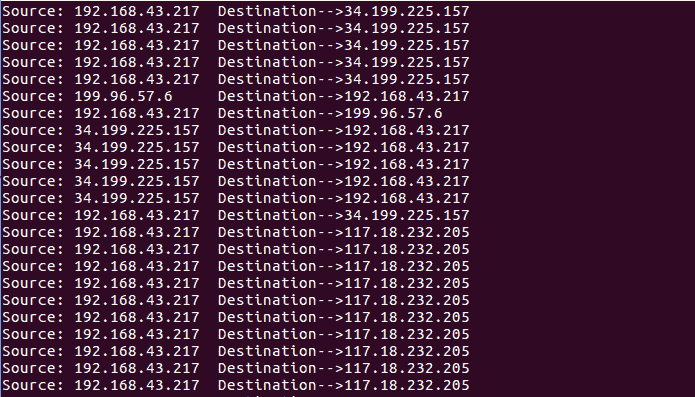

# 使用 dpkt 库分析网络流量

> 原文：<https://www.studytonight.com/network-programming-in-python/analyzing-network-traffic>

我们将使用`dpkt`库来分析网络流量。`dpkt`是一个 python 模块，用于快速、简单的数据包创建/解析，并定义了基本的 TCP/IP 协议。为了使用`dpkt`你首先需要安装它。

* * *

## 安装`dpkt`模块

```
sudo pip install dpkt
```

**注**:如果以 root 用户身份登录，可以省略上面命令中的`sudo`。

在本课中，我们将使用 python 代码从保存了 Workshire 流量数据的`.pcap`文件中提取网络上数据包的**源 IP** 和**目的 IP** 地址。将捕获的 pcap 文件保存在某个位置(比如桌面)后。运行以下代码:

```
#!usr/bin/env python
# this code prints Source and Destination IP from the given 'pcap' file

import dpkt
import socket

def printPcap(pcap):
	for (ts,buf) in pcap:
		try:
			eth = dpkt.ethernet.Ethernet(buf)
			ip = eth.data
			# read the source IP in src
			src = socket.inet_ntoa(ip.src)
			# read the destination IP in dst
			dst = socket.inet_ntoa(ip.dst)

			# Print the source and destination IP
			print 'Source: ' +src+ ' Destination: '  +dst

		except:
			pass

def main():
	# Open pcap file for reading
	f = open('/home/codeplay/Desktop/first.pcap')
	#pass the file argument to the pcap.Reader function
	pcap = dpkt.pcap.Reader(f)
	printPcap(pcap)

if __name__ == '__main__':
	main()
```

在上面的代码中，方法`printPcap()`、`ts`和`buf`分别是时间戳和缓冲区。你可能已经注意到插座方法`inet_ntoa`和`inet_aton`。`inet_aton`将 32 位压缩 IPv4 地址(长度为四个字符的字符串)转换为其标准的四点字符串表示形式(例如，123.45.67.89)。

**<u>输出:</u>**



* * *

* * *