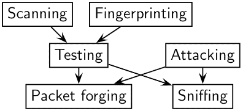
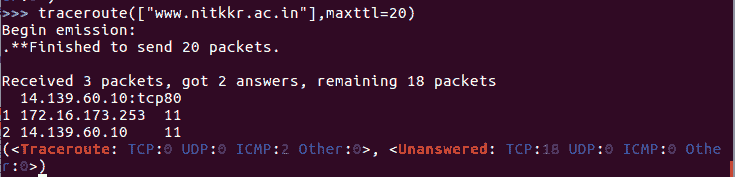

# scapy 简介

> 原文：<https://www.studytonight.com/network-programming-in-python/introduction-to-scapy>

在上一个教程之后，你一定已经对使用`dpkt`模块可以做什么有了足够的了解。在本课中，我们将了解另一个 python 模块，它允许我们发送、嗅探、剖析和伪造网络数据包。这种能力允许构建能够探测、扫描或攻击网络的工具。



* * *

## 我们为什么要用`scapy`？

你可能会想，既然已经有了`dpkt`模块，为什么还要用`scapy`。他们不是在做同样的事情吗！不完全是，事实是`scapy`为我们提供了比任何其他工具或模块更多的功能。

`scapy`除了基本的嗅探网络数据包的用法外，还执行其他大部分其他工具都做不到的任务，比如*发送无效帧*、*注入自己的 802.11 帧*、*组合技术(VLAN 跳频+ ARP 缓存中毒、WEP 加密通道上的 VOIP 解码等。)*等。

**802.11 帧**基本上是无线帧包，不能使用`dpkt`库操控。

所以来吧，让我们不再浪费时间，安装`scapy`:

```
sudo pip install scapy
```

或者下载软件包并安装，请点击此处链接。

* * *

## 点火(运行)`scapy`

1.  如果您正在运行终端会话(Mac OSx 用户)，或者您是 linux 用户，则:

    ```
    $ sudo scapy
    ```

    欢迎来到 Scapy (2.0.1-dev)> > >

2.  如果您是 Windows 用户，则:

    ```
    C:\>scapy
    ```

    信息:内核不支持 IPv6 警告:找不到 IPv6 目的地的路由::(没有默认路由？)欢迎来到 Scapy (2.0.1-dev)> > >


如果您没有安装所有可选软件包，scapy 将通知您某些功能将不可用:

信息:无法导入 python gnuplot 包装。无法策划。信息:无法导入 PyX。无法使用 psdump()或 pdfdump()。

* * *

## 读取`pcap`文件

您可以从一个`pcap`文件中读取数据包，并将其写入另一个`pcap`文件。

```
>>> a = rdpcap("/home/ntal8/Desktop/bkp_pcap/rawcap.pcap")
>>> a
```

<rawcap.pcap: tcp:749="" udp:134="" icmp:0="" other:2=""></rawcap.pcap:>

* * *

## `scapy`特征一瞥

1.  **TCP Traceroute**: Unlike other traceroute programs, who wait for each node to reply before going to the next, `scapy` sends all the packets at the same time.

    

    最后一行实际上是函数的结果:traceroute 结果对象和未应答数据包的数据包列表。

2.  **TCP Port Scanning**: Send a `TCP SYN` on each port. Wait for a `SYN-ACK` or an `RST` or an `ICMP` error.

    ```
    >>> res,unans = sr( IP(dst = "target")
    ...   	/TCP(flags="S", dport=(1,1024)) )
    ```

    可能的结果可视化:**开放端口**

    ```
    >>> res.nsummary( lfilter=lambda (s,r): (r.haslayer(TCP) and (r.getlayer(TCP).flags & 2)) )
    ```

要了解更多关于`scapy`的功能和特点，请访问 [scapy 的官方文档](https://scapy.readthedocs.io/en/latest/usage.html)。

* * *

* * *