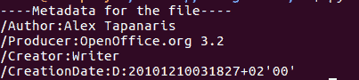

# 从 PDF 文件中提取元数据

> 原文：<https://www.studytonight.com/network-programming-in-python/extracting-metadata-from-pdf-files>

本教程属于`Cyber Forensics`范畴。我们要讨论的例子是一个现实生活中的事件，黑客组织**匿名**的一名成员被捕，此前他们发布了一个 PDF 文件(作为 oress 版本)，其中包含了关于他们的组织及其实施的在线攻击的信息。对他不利的证据是，从发布的 PDF 文件中提取的元数据。您可以从这里的[下载 pdf。](http://www.wired.com/images_blogs/threatlevel/2010/12/ANONOPS_The_Press_Release.pdf)

在本教程中，我们还将尝试从上述 pdf 文件中提取元数据，并查看它包含哪些信息。但是首先，让我们试着理解**什么是元数据？**

> *元数据是关于数据的数据。元数据是解释、描述或定位原始主数据的结构化信息，或者以其他方式使原始主数据的使用更加高效的结构化信息。*

简单地说，元数据保存了关于数据的信息。如果 PDF 文件包含一些数据，元数据将是 PDF 的创建日期，它甚至可能包含创建它的计算机的 Mac 地址、作者姓名、用来创建 PDF 的软件等。

现在，在我们真正开始从 PDF 文件中提取元数据之前，我们还需要做一件事。我们需要安装另一个名为`pyPdf`的 python 模块。要安装它，只需遵循以下步骤:

*   从[这里](https://pypi.python.org/pypi/pyPdf)下载`pyPdf`**tar.gz**文件。
*   使用以下命令提取 tar.gz 文件:`tar -xvzf 'filename'`
*   现在将您的目录更改为新提取的文件夹。
*   通过运行`python setup.py install`命令安装软件包。

* * *

## 从 PDF 文件中提取元数据的程序

以下是从 PDF 文件中提取元数据的程序:

**meta_extract.py**

```py
#!usr/bin/env python
# This program displays metadata from pdf file

import pyPdf

def main():
    # Enter the location of 'ANONOPS_The_Press_Release.pdf'
    # Download the PDF if you haven't already
	filename = <LOCATION_OF_THE_PDF>

	pdfFile = pyPdf.PdfFileReader(file(filename,'rb'))
	data = pdfFile.getDocumentInfo()

	print "----Metadata of the file----"

	for metadata in data:
		print metadata+ ":" +data[metadata]

if __name__ == '__main__':
	main()
```

<u>**输出:**</u>



所以现在，每当你收到任何可疑的 PDF 文件，你都可以很容易地访问它的元数据来找出它的来源。酷！不是吗？

* * *

* * *