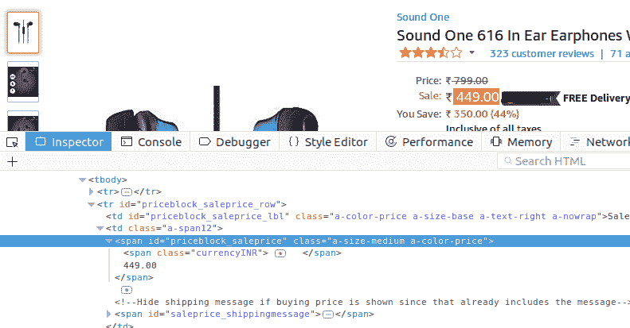

# 什么是网页抓取？

> 原文：<https://www.studytonight.com/network-programming-in-python/web-scraping>

**网页抓取**是一种从网站中提取/抓取信息的技术。该技术主要关注于将网络上的非结构化数据(HTML 格式)转换为结构化数据。

为此我们将使用名为`BeautifulSoup`的 python 库。现在不用担心，我们将在[下一个教程](example-of-web-scraping)中有程序示例。我们的网页抓取程序将使用这个库来解析网站的 HTML 并提取数据。我们还将使用`Requests Library`打开网址，下载 HTML 并将其传递给`BeautifulSoup`。

详细教程，请访问我们的[**Python 网页抓取使用美丽的程序**](/python/web-scraping/introduction-to-web-scraping) 教程。

**注意:**很多网站不允许网页抓取，可能会给你带来法律上的麻烦。因此，我们建议您仅将此用于学习目的，不要从网站上窃取或复制数据。

* * *

## 安装模块

要安装所需的 python 模块，请遵循以下说明:

1.  **适用于 Linux/Mac OSx 用户:**

    ```py
    $ sudo pip install BeautifulSoup
    $ sudo pip install Requests
    ```

2.  **对于窗口用户:**

    ```py
    $ pip install BeautifulSoup
    $ pip install Requests
    ```

* * *

## 网页抓取基础

如果你曾经访问过一个网站并查看过源代码(右击→查看页面源代码)，你一定在那里看到了很多蹩脚或不可理解的信息。嗯，除非我们得到一些可以理解的或者结构良好的东西，否则它是没有用的。因此，要从一个网站上删除数据(比如我们想获得电子商务网站特定页面上所有产品的价格)，首先我们需要唯一识别网站上保存数据的 HTML 标签。问题是怎么做？

所以，如果你知道 [HTML 基础知识](/code/html/)(点击链接，使用我们的互动课程学习 HTML)，你一定知道 HTML 标签和属性。这就是诀窍，我们使用 HTML 标签或属性或两者来唯一识别网站上的任何数据。我们来看一个例子。

要从网站上唯一识别**价格标签**:

1.  右键单击显示的价格。
2.  点击**检查元素**。



这里可以看到价格 **449.00** 可以唯一标识为:

```py
<span id="priceblock_saleprice" class="a-size-medium a-color-price">
```

现在，假设我们想要获取数据，并希望将其与从其他网站收集的数据进行比较/存储。这就是刮擦发挥作用的地方。它可以用于从多个网站中挖掘数据。这项技术现在正被广泛使用。很多像 **Trivago** 这样的网站，只比较不同平台同一产品的价格，用的是同样的技术。

* * *

* * *