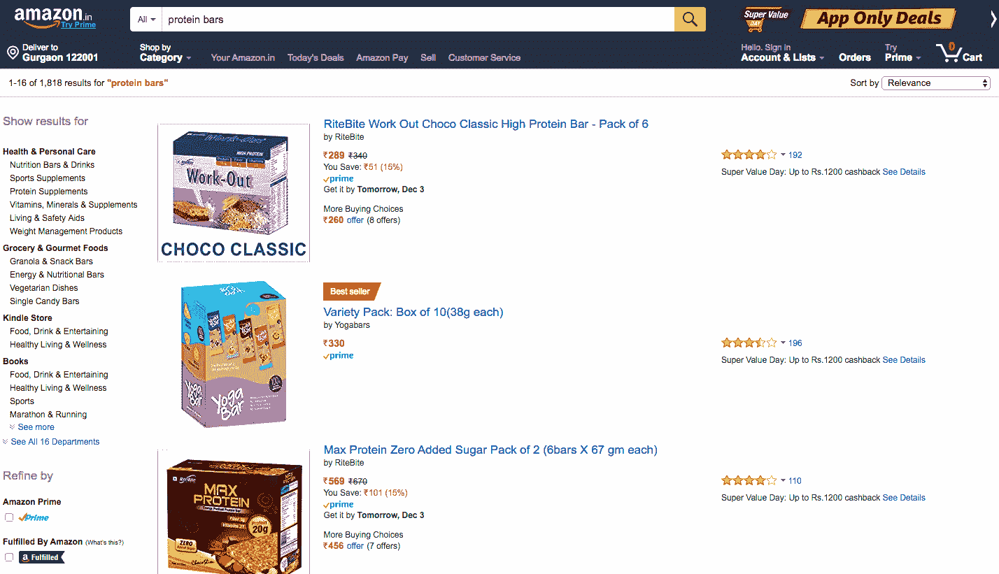
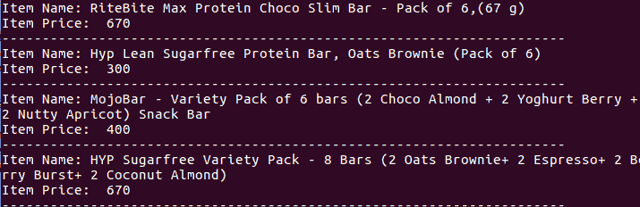

# 实现网页抓取

> 原文：<https://www.studytonight.com/network-programming-in-python/example-of-web-scraping>

让我们试着从电子商务巨头亚马逊那里提取一些数据。让我们搜索“Protien Bars”和相关产品，然后我们将从获得的搜索结果中刮取数据。



上面我们有一个网页截图，以及搜索结果。现在第一步将是识别保存我们想要抓取的数据的 HTML 标签。

*   项目名称:右击**产品名称→检验元素**
*   项目价格:右键**产品价格→检验要素**

对于低于 HTML 标签的项目价格，已使用:

```py
<span class="a-size-base a-color-price a-text-bold">
```

因此，在`span`标签中，我们必须寻找带有值**的`class`属性，一个基于大小、颜色、价格的粗体**。

同样，对于项目名称，使用以下 HTML 标记:

```py
<h2 class="a-size-medium s-inline s-access-title a-text-normal" ...>
    ITEM_NAME
</h2>
```

现在，让我们编写提取数据的程序/脚本。

* * *

## 网页抓取程序/脚本

```py
#!usr/bin/env python

import requests
from bs4 import BeautifulSoup

# url of the search page
url = "http://www.amazon.in/s/ref=nb_sb_ss_i_4_8?url=search-alias%3Daps&field-keywords=protein+bars&sprefix=protein+%2Caps%2C718&crid=1SW4WFJE8O22T&rh=i%3Aaps%2Ck%3Aprotein+bars"

r = requests.get(url)			# get the search url using requests
soup = BeautifulSoup(r.content)	# create a BeautifulSoup object 'soup' of the content

# Item Name
i_name = soup.find_all("h2",{"class": "a-size-medium s-inline  s-access-title  a-text-normal"})

#'find_all' method is used to find the  matching criteria as mentioned in parenthesis

# Item Price
i_price = soup.find_all("span",{"class": "a-size-base a-color-price a-text-bold"})

# Now print Item name and price
# 'zip' is used to traverse parallely to both name and price
for name,price  in zip(i_name,i_price):
	print "Item Name: " +name.string
	print "Item Price:" +price.text
	print '-'*70
```

在单一教程中涵盖`BeautifulSoup`模块的所有技术细节和特性是不可能的。所以，我们会推荐你阅读官方文档[这里](https://www.crummy.com/software/BeautifulSoup/bs4/doc/)。

> **注意:** *在这里你可能会感到困惑，因为一些产品的价格显示不正确。这是因为我们在这里用于价格提取的类名对于某些项目(正在提供)是不同的。所以你需要改变这些项目的类名。*



所以现在你知道如何从任何网站收集数据了。虽然`BeautifulSoup`模块确实也提供了很多其他功能，但是使用上面的脚本/程序，你可以很容易地从任何网站上抓取数据。

记住 2 个步骤:识别 HTML 标签，然后用程序刮。

* * *

* * *