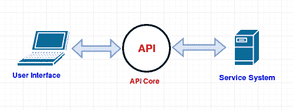

# 什么是 API？

> 原文：<https://www.studytonight.com/network-programming-in-python/understanding-api>

你去过酒店或餐馆吗？你一定有！在那里，你一定利用了服务员提供的服务。服务员是这样的人，他接受你的订单，把订单送到酒店厨房，然后把你要的食物送回来。嗯，一个应用编程接口与此非常相似。

> *应用程序接口(API)是用于构建软件应用程序的一组例程、协议和工具。应用编程接口指定软件组件应该如何交互。*

操作系统、应用程序和网站有许多不同类型的 API。当你现在访问一个网站的时候，你一定已经看到，他们有多个注册选项，比如:注册脸书，谷歌，领英等。这是最近应用编程接口最常见的用法。以下是一些常用的 API 列表:

*   **谷歌地图 API** :谷歌地图 API 让开发者在网页上嵌入谷歌地图。
*   **YouTube API** :允许你在自己的网页中集成 YouTube 视频和功能。
*   **社交 API** :包括脸书、推特、领英、Reddit 等 API。他们使用 API 向您提供对其注册用户的公共数据的访问。

我们之前说过，那个 API 就像一个服务员，我们的意思是它不会让你知道，方法或者程序是如何运作的，通过它来准备请求的菜。它只会给你带来准备好的菜，不管它是用什么方法做的。同样，假设您通过社交应用编程接口请求了一些用户数据。因此，API 代表您请求 web 服务(比如脸书)，并向脸书服务器发出适当的请求，然后将结果返回给您。

* * *

## 使用应用编程接口的优势

原料药的一些优点如下:

1.  **安全性**:使用第三方提供者(比如 Google 等)的 API 在其他一些 web 应用中记录和共享数据要安全得多。
2.  **自动化**:应用编程接口非常容易地实现和促进自动化过程。您可以在自己的代码中使用一些 web 服务的 API 来自动执行任务，如检查时间表、发布消息等。
3.  **集成**:API 允许内容更容易地从任何网站或应用程序嵌入。这保证了更流畅的信息传递和集成的用户体验。
4.  **外部数据库访问**:API 允许网站访问者访问远程的、有密码保护的数据库。您的应用编程接口密码和用户名授权在您的网站和应用编程接口的数据库驱动资源之间交换信息的权限。

* * *

* * *