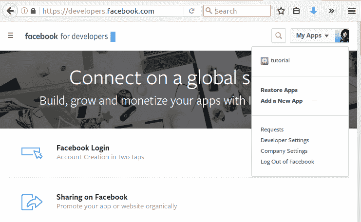
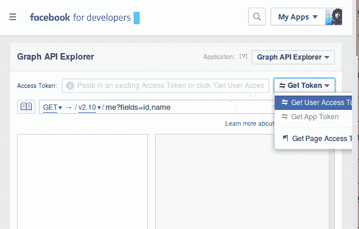

# 使用脸书图形应用编程接口

> 原文：<https://www.studytonight.com/network-programming-in-python/facebook-graph-api>

从现在开始，你必须熟悉 API 这个词。如今，社交 API 在收集个人、组织或几乎任何事物的信息方面发挥着重要作用。因此，我们将考虑使用 python 从脸书挖掘一些数据来实现**脸书图形应用编程接口**。

如果你去[https://developers.facebook.com/docs/](https://developers.facebook.com/docs/)，你会发现 facebook 提供 API 支持的语言。但是，facebook 没有为 python 提供官方客户端。因此，我们将使用脸书软件开发工具包来代替。在我们开始挖掘(提取或数据挖掘)一些数据之前，让我们首先安装 python 的脸书 SDK。很简单:

```py
sudo pip install facebook-sdk
```

在从脸书跳入数据挖掘之前，我们必须先满足一些要求。我们需要一个`Access Token`来访问社交网站上的任何数据并收集信息。那么，什么是`Access Token`？

简单来说，假设这是脸书(或任何其他网站)提供的一种访问代码或权限，这样您就可以作为合法用户访问数据，他们也可以跟踪数据。

> *访问令牌是描述进程或线程的安全上下文的对象。令牌中的信息包括与进程或线程相关联的用户帐户的身份和权限。*

您需要有一个脸书帐户来请求访问令牌。现在按照以下步骤操作:

1.  登录您的帐户。
2.  参观[https://developers.facebook.com/](https://developers.facebook.com/)
3.  Now, on the top right section. Click on **Get Started** section. And follow the formalties and proceed.

    

4.  现在，为你的**应用**选择一个显示名称，点击**创建应用标识**。
5.  生成您的`App ID`后，访问[https://developers.facebook.com/tools/explorer/](https://developers.facebook.com/tools/explorer/)
6.  Now, click on **Get Token → Get User Access Token**. If you have multiple apps than you might need to select for which app you want to generate the token.

    

7.  现在选择**用户数据权限**，点击**获取访问令牌**
8.  Your token will be generated. Copy that to clipboard. It is advised not to share this access token. And if you are using it in a program, do not use directly. It is advised to save this token in a separate file and take input from there or set an enviroment variable like `$ set FACEBOOK_TEMP_TOKEN = "YOUR_TOKEN"`.

    但是，由于这些令牌在一段时间后过期，您需要一次又一次地更新它。

* * *

* * *