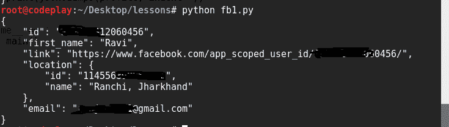
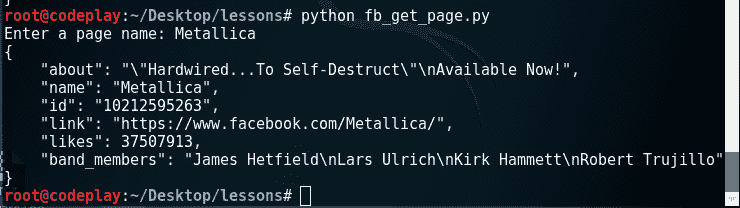

# 挖掘自己的脸书账户

> 原文：<https://www.studytonight.com/network-programming-in-python/mining-facebook-data>

我们来看看如何挖掘**用户名****邮箱****位置****网站**等信息。使用 python 脚本自动从用户帐户下载。

首先让我们看看代码:

```py
#!usr/bin/env python
# Program to mine data from your own facebook account

import json
import facebook

def main():
	token = "{Your Token}"
	graph = facebook.GraphAPI(token)
	#fields = ['first_name', 'location{location}','email','link']
	profile = graph.get_object('me',fields='first_name,location,link,email')	
	#return desired fields
	print(json.dumps(profile, indent=4))

if __name__ == '__main__':
	main()
```

在`main()`方法中，我们试图获得关于我们自己的脸书账户的信息。让我们尝试逐行理解代码:

*   `token`:是访问页面所需的访问令牌。
*   在下一行中，我们创建了一个`GraphAPI`对象来访问 API 方法。
*   现在，我们已经在变量`profile`中提取了所需的字段。在这里，注意`get_object()`方法中的`'me'`表示我们是为了自己的利益。
*   `first_name`:返回用户的名字。
*   `location`:他们在个人资料中输入的当前位置。此字段与签入无关。
*   `email`:个人资料中列出的主要电子邮件地址。如果没有有效的电子邮件地址，则不会返回此字段。
*   `link`:人物时间线的链接。

除了这些领域，还有许多领域。有关字段的完整列表和描述，请参考脸书图形应用编程接口官方文档，此处为。

<u>**输出:**</u>



上面代码的最后一行转储变量`profile`中获取的信息的 json 格式。

* * *

## 从脸书页面挖掘数据

现在，在这个例子中，我们将从“金属之神”乐队的脸书页面提取数据。要查看可从页面中提取的字段列表，请参考此处的。

```py
#!usr/bin/env python
# Program to get a page information

import json
import facebook

def main():
	token = "{Your Token}"
	graph = facebook.GraphAPI(token)
	page_name = raw_input("Enter a page name: ")

	# list of required fields
	fields = ['id','name','about','likes','link','band_members']

	fields = ','.join(fields)

	page = graph.get_object(page_name, fields=fields)

	print(json.dumps(page,indent=4))

if __name__ == '__main__':
	main()
```

<u>**输出:**</u>



* * *

* * *