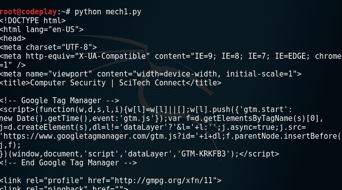
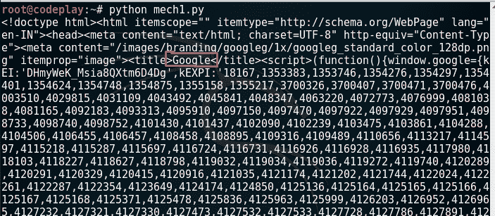

# Python 的`mechanize`库

> 原文：<https://www.studytonight.com/network-programming-in-python/mechanize-library>

一般来说，用户可以使用浏览器或者通过使用许多不同的方法和工具查看源代码来查看网站；Linux 程序`wget`是一种流行的方法。如果你想用 Python 打开一个网站，浏览互联网的唯一方法就是检索和解析网站的 HTML 源代码。在本教程中，我们将学习如何为此目的使用**`mechanize`库**。

要使用`mechanize`库，请从[这里](https://pypi.python.org/pypi/mechanize/)下载它的 tar.gz 文件。提取`tar`文件并使用`python setup.py install`安装

Mechanize 的主类`Browser`，允许操作任何可以在浏览器中操作的东西。让我们看一个使用 Mechanize Library 查看网站源代码的例子:

**机械**

```py
#!usr/bin/env python
#Program to view source code using mechanize

import mechanize

def page_view(url):
	try:
		#create browser object
		browser = mechanize.Browser()

		#browser.set_handle_robots(False)
		page = browser.open(url)
		src_code = page.read()
		#print source code
		print src_code  	
	except:
		print "Error in browsing..."

url = "http://www.syngress.com/"
page_view(url)
```

**输出:**



现在，在脚本中`mech1.py`将 url 更改为**https://www.google.com**。你看到了什么？**“浏览错误……”**现在让我们仔细分析一下这个错误。从上述代码中删除除语句外的 **try &语句，并尝试再次执行该代码。哎呀！它仍然不起作用，但这次你会看到详细的错误。您一定看到错误消息，指出:**


从错误中我们可以看到， **robots.txt** 文件有问题。你知道什么是**机器人文件吗？利用这个文件，任何网站都可以通知谷歌、必应等搜索引擎抓取或不抓取任何网页。因此，如果你有一个网站，你不希望谷歌抓取任何特定的网页(可能是内部使用)，那么你可以在 **robots.txt** 文件中指定。**

现在，进入问题。所以出现上述错误是因为网站阻止我们的浏览器访问他们的网页。那么，我们该怎么办呢？我们指示我们的`mechanize` `browser`对象忽略机器人文件的网站解析。为此，只需在 **mech1.py** 中取消注释以下行:`browser.set_handle_robots(False)`

现在，如果你访问 Google.com，你可以看到如下内容:



* * *

* * *