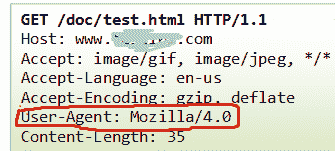
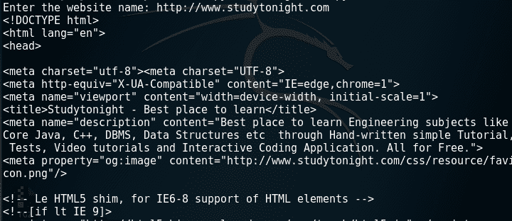
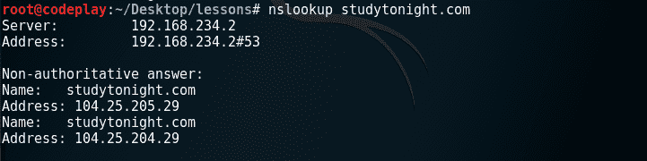
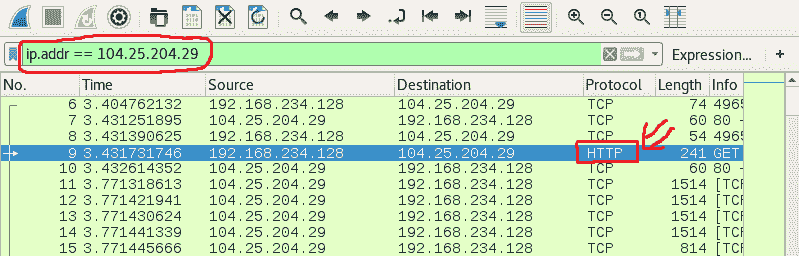
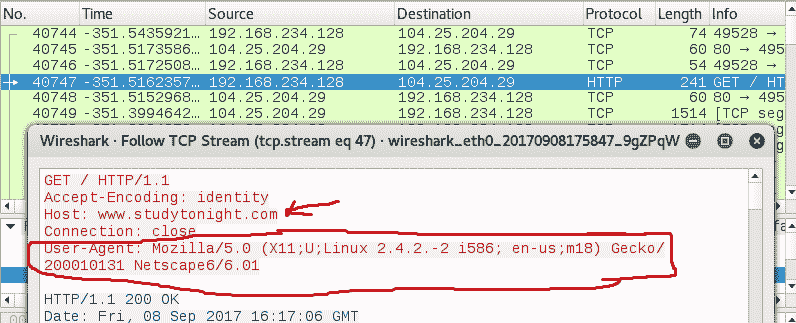

# 使用机械化库更改浏览器的用户代理

> 原文：<https://www.studytonight.com/network-programming-in-python/changing-user-agent>

在本教程中，我们将学习如何使用`mechanize`库更改浏览器的用户代理，并将尝试修改 HTTP 请求头。

* * *

## 什么是用户代理？

在计算中，**用户代理**是代表用户的任何东西。Borwser 的用户代理是一个字符串或一行文本，包含关于浏览器和操作系统的信息，在 HTTP 请求头中发送到网络服务器。这允许网站定制内容，以最适合特定设备的功能，但共享这些信息也会引发某些隐私问题。

在典型的 HTTP 请求/响应周期中，您可以在 HTTP 请求/响应头中查看浏览器的用户代理。它看起来像是:



但是，通过使用`mechanize`我们可以改变 HTTP 请求头的用户代理字段，来欺骗(愚弄)web 服务器。让我们看看如何做到这一点，使用 python 脚本，我们将尝试将用户代理设置为:

```
user_agent = 
        [('User-agent',
        'Mozilla/5.0 (X11;U;Linux 2.4.2.-2 i586; en-us;m18) Gecko/200010131 Netscape6/6.01'
        )]
```

让我们看看代码:

```
#Program to change the user agent
#Verify the UserAgent with wireshark tool

import mechanize

#function to browse the web page
def change_user_agent(url, user_agent):
	try:
		#Create browser object
		browser=mechanize.Browser()
		browser.set_handle_robots(False)
		#add user agent
		browser.addheaders=user_agent

		#open web url
		page=browser.open(url)

		#read page source code
		source_code = page.read()

		#print source code
		print source_code
	except:
		print "Error in browsing....."

url = str(raw_input("Enter the website name: "))

#user agent details
user_agent=[('User-agent','Mozilla/5.0 (X11;U;Linux 2.4.2.-2 i586; en-us;m18) Gecko/200010131 Netscape6/6.01')]

change_user_agent(url,user_agent)
```

让我们运行上面的脚本，我们输入的网站名称为**studytonight.com**:



看来我们的脚本执行成功了。现在让我们看看用户代理是否更改。当你打开 **Wireshark** 时，你会看到巨大的流量。比如何过滤所需的？我们将使用 linux 操作系统的一个强大工具，即`'nslookup'`命令。



我们已经对运行上述脚本的网站名称进行了查找。我们现在有了所需网站的 IP 地址。所以现在我们可以使用 Wireshark 过滤这个 IP 地址的流量。只需在 wireshark 滤镜栏中键入:`ip.addr == 104.25.205.29`。现在，您将看到所有具有以下 IP 地址的数据包。现在，转到具有 **HTTP 协议**的数据包，并右键单击它。



右键单击后→跟随→ TCP 流



虽然我们已经使用`mechanize`库浏览了网站。但是我们已经成功地欺骗了作为 HTTP 请求头的一部分发送的用户代理信息。这些伎俩被安全研究人员用来隐藏他们的身份。

* * *

* * *