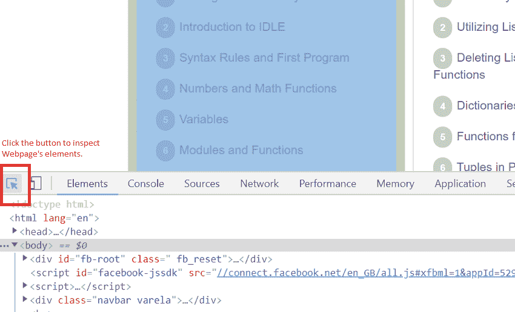
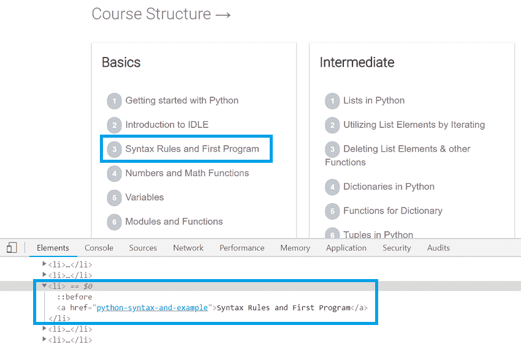

# 网页抓取简介

> 原文：<https://www.studytonight.com/python/web-scraping/introduction-to-web-scraping>

互联网是一个通过各种网站传播的信息海洋，在这里它被分类，相互联系，并且大多数是免费提供给每个人的。

例如:如果你想知道某个特定产品的市场价格，你可以亲自去市场询问店主，或者你可以在亚马逊、易趣等在线商店搜索该产品。但是如果你想要某一价格范围内某一特定类别的所有产品的清单呢？你显然会更喜欢网上商店，因为你家周围的店主不会用所有产品的清单来招待你。

但是从互联网上获取这样的数据/信息有时并不容易。对于这种情况和需求，我们使用程序从任何网站解析和获取数据，这种通过解析 HTML 代码从网站中提取大量数据的技术被称为**网页抓取**。

我们在这里学习如何去做。所以不再拖延，让我们开始吧。

* * *

## 先决条件

要很好地学习本教程，您必须事先知道几件事，它们是:

1.  Python 编程语言。如果你不知道蟒蛇，参加今晚的蟒蛇课程。
2.  HTML 基础知识。了解 HTML 会促进你的进步。你可以在今晚学习上开始学习 [HTML 本身。](https://www.studytonight.com/code/html/)

考虑到您知道 python 和 HTML，让我们设置网页抓取工作所需的所有工具/包。

如果你的电脑上没有安装 Python。去 python 官网下载。下载后，按照教程[开始使用 Python](/python/getting-started-with-python) 进行逐步指导。

我们还需要 python 库中的`bs4`和`requests`模块来进行网络裁剪。现在，我们将安装我们将要使用的所有必需模块。

* * *

### 安装`bs4`模块

要安装`bs4`模块，请在命令行中运行以下命令:

```py
pip install bs4
```

安装后，通过运行以下代码检查是否安装。

```py
import bs4
```

如果以上命令执行没有任何错误，那么您已经成功地在您的计算机中安装了`bs4`模块。

### 安装`requests`模块

在命令行中运行以下命令安装`requests`模块。

```py
pip install requests
```

同样，安装后，通过运行以下代码检查是否安装了它。

```py
import requests
```

如果以上命令执行没有任何错误，那么您已经成功地在您的计算机中安装了`request`模块。

有了这个，我们就可以开始刮网了。

* * *

## 刮擦规则

从任何网站抓取数据时，您都应该记住以下几点:

1.  浏览你想从中获取数据的网站的**条款&条件**。有些网站不允许网页抓取将数据用于商业用途，而有些网站允许，因此我们建议您阅读条款和条件。
2.  运行网页抓取程序时，不要过于主动地向网站请求数据，因为这可能会降低网站的速度。
3.  一旦你的脚本写好了，如果网站改变了它的界面，可能就无法工作了，在运行你的网页抓取脚本之前，请确认网站布局的任何改变。

* * *

## 检查任何网页

这永远是刮网过程的第一步，或者我们可以说这是第 0 步。

我们可以使用浏览器工具，如 Chrome 的开发者控制台等，检查任何网站的用户界面和相关的 HTML 代码。

例如，如果你想在今晚的学习网站上从教程的左侧栏中获取所有的主题名称，那么如果你正在使用视窗上的 Chrome 浏览器，请按 **F12** 键打开开发工具(对于 macOS，请按**命令+选项+ I** )。



然后点击左上角的按钮，如上图所示。一旦你点击了那个按钮，你所要做的就是将鼠标指针悬停在任何网页的元素上，你就会在开发者工具的**元素**视图中看到它的 HTML 代码。



这就是我们最初搜索和查找网页抓取元素的方式。

* * *

* * *