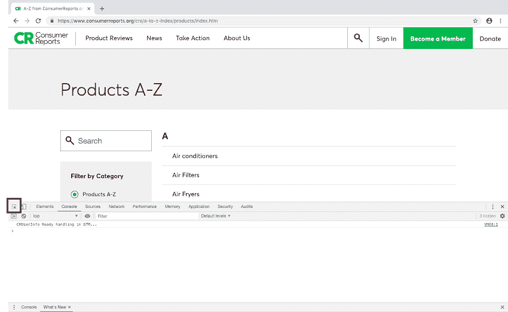
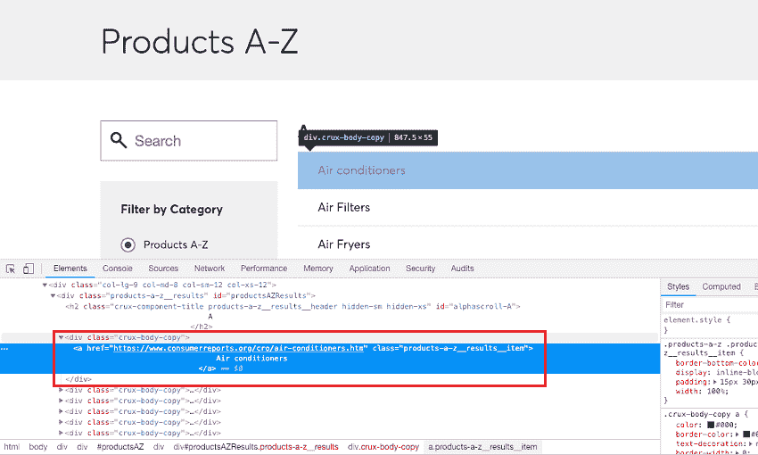

# 从消费者报告网站抓取产品名称

> 原文：<https://www.studytonight.com/python/web-scraping/web-scraping-practical-example-1>

**注:**本教程仅用于教育目的，我们要求读者不要使用该代码对网站进行任何形式的伤害。

在本教程中，我们将学习如何从任何网站上抓取数据。我们从中获取数据的网站是**消费者报告**网站。我们将从这个[网址](https://www.consumerreports.org/cro/a-to-z-index/products/index.htm)请求数据，然后从中收集**产品名称**列表。

让刮擦开始...

```py
## importing bs4, requests and fake_useragent modules
import bs4
import requests
from fake_useragent import UserAgent

## initializing the UserAgent object
user_agent = UserAgent()
url = "https://www.consumerreports.org/cro/a-to-z-index/products/index.htm"

## getting the reponse from the page using get method of requests module
page = requests.get(url, headers={"user-agent": user_agent.chrome})

## storing the content of the page in a variable
html = page.content
```

到了这一步，我们已经在变量`html`中存储了网页的完整源代码。现在让我们创建一个漂亮的输出对象。你甚至可以尝试运行`prettify`方法。

```py
## creating BeautifulSoup object
soup = bs4.BeautifulSoup(html, "html.parser") 
```

我们还创建了一个美丽的组对象，现在呢？我们如何知道从 HTML 代码中找到并提取哪个标签。我们应该在 HTML 代码中搜索它吗？不可能！

还记得在本系列的第一个教程中，当我们[引入术语网页抓取](introduction-to-web-scraping)时，我们确实与您分享了一种技术，在这里我们可以使用 **Chrome 浏览器的开发工具**来查找任何网页元素的 HTML 代码。(其他浏览器如火狐等也有自己的开发工具，也可以使用。)

如果您使用的是 Windows，请按 **F12** 键打开开发者工具(在 chrome 浏览器中)，如果您是 Mac 用户，请按**选项+命令+ I** 键。

点击左上角按钮:



然后将鼠标光标悬停在产品列表条目上以查找它们的 HTML 标记:



我们可以看到，**锚点**标签包含产品报告页面的网址和产品名称，并包含在一个带有`class`属性值**的`div`标签中。这就是我们开始的地方，我们将获取所有`div`标签，其`class`属性值等于**症结-身体-副本**:**

```py
## div tags with crux-body-copy class
div_class = "crux-body-copy"

## getting all the divs with class 'crux-body-copy'
div_tags = soup.find_all("div", class_="div_class")

## we will see all the div tags 
## enclosing the anchor tags with the required info
for tag in div_tags:
    print(tag)
```

[空调](https://www.consumerreports.org/cro/air-conditioners.htm).........

由于上述代码的完整输出太长，我们将其存储在[文件](resources/cr-product-list-html.txt)中(下载文件查看)。

现在下一步是从附带的`div`标签中提取产品名称和各个产品网页的链接。

```py
## extracting the names and links from the div tags
for tag in div_tags:
    name = tag.a.text.strip()
    link = tag.a['href']

    print("{} ---- {}".format(name, link))
```

空调-https://www.consumerreports.org/cro/air-conditioners.htm 空气过滤器-https://www.consumerreports.org/cro/air-filters.htm 空气油炸锅-https://www.consumerreports.org/cro/air-fryers.htm 空气床垫-https://www.consumerreports.org/cro/air-mattresses.htm.........

看，多简单。有了这个，我们成功地从一个网站上收集了数据。

以下是完整的代码供您参考:

```py
## importing bs4, requests and fake_useragent modules
import bs4
import requests
from fake_useragent import UserAgent

## initializing the UserAgent object
user_agent = UserAgent()
url = "https://www.consumerreports.org/cro/a-to-z-index/products/index.htm"

## getting the reponse from the page using get method of requests module
page = requests.get(url, headers={"user-agent": user_agent.chrome})

## storing the content of the page in a variable
html = page.content

## creating BeautifulSoup object
soup = bs4.BeautifulSoup(html, "html.parser")

## div tags with crux-body-copy class
div_class = "crux-body-copy"

## getting all the divs with class 'crux-body-copy'
div_tags = soup.find_all("div", class_="div_class")

## extracting the names and links from the div tags
for tag in div_tags:
    name = tag.a.text.strip()
    link = tag.a['href']

    print("{} ---- {}".format(name, link))
```

试着在你的机器上运行这段代码，如果你遇到任何问题，你可以在这里发布你的问题: [**StudyTonight Q & A 论坛**](/studyroom)

* * *

* * *