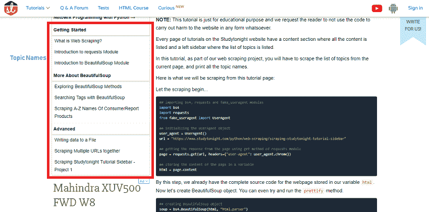

# 从StudyTonight教程网页中抓取主题名称

> 原文：<https://www.studytonight.com/python/web-scraping/scraping-studytonight-tutorial-sidebar>

**注:**本教程仅用于教育目的，我们要求读者不要使用该代码对网站进行任何形式的伤害。

“今夜研究”网站上的每一页教程都有一个列出所有内容的内容部分和一个列出主题列表的左侧边栏。

在本教程中，作为我们网页抓取项目的一部分，您必须从当前页面抓取主题列表，并打印所有主题名称。

以下是我们将从本教程页面中获取的内容:



让刮擦开始...

```py
## importing bs4, requests and fake_useragent modules
import bs4
import requests
from fake_useragent import UserAgent

## initializing the UserAgent object
user_agent = UserAgent()
url = "https://www.studytonight.com/python/web-scraping/scraping-studytonight-tutorial-sidebar"

## getting the reponse from the page using get method of requests module
page = requests.get(url, headers={"user-agent": user_agent.chrome})

## storing the content of the page in a variable
html = page.content
```

到了这一步，我们已经在变量`html`中存储了网页的完整源代码。现在让我们创建一个漂亮的输出对象。你甚至可以尝试运行`prettify`方法。

```py
## creating BeautifulSoup object
soup = bs4.BeautifulSoup(html, "html.parser") 
```

我们还创建了一个美丽的组对象，现在呢？我们如何知道从 HTML 代码中找到并提取哪个标签。我们应该在 HTML 代码中搜索它吗？不可能！

现在是使用开发人员工具的时候了。

如果您使用的是 Windows，请按 **F12** 键打开开发者工具(在 chrome 浏览器中)，如果您是 Mac 用户，请按**选项+命令+ I** 键。

点击左上角的按钮，将鼠标悬停在边栏上方，找到用于制作教程主题列表的 HTML 标签。

现在，由于这是一个需要你们完成的项目，这里有一些提示供你们参考。

1.  侧边栏有使用 HTML 标签`<li>`创建的**列表**元素
2.  作为标题的列表项有一个用于样式的类`main`。
3.  所有教程题目都在**类** `main`的列表项下，直到遇到下一个**类** `main`的列表项。
4.  你应该首先找出所有的`<li>` HTML 标签，把它们存储在**列表**中。
5.  然后寻找类为`main`的`<li>` HTML 标签，也存储在列表中。
6.  第一个列表中的附加`<li>`标签是教程主题。

听起来有点棘手，但你们可以做到。如果你在编写解决方案时遇到任何问题，你可以在今晚的问答论坛上提问。

* * *

* * *