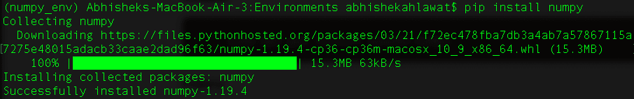
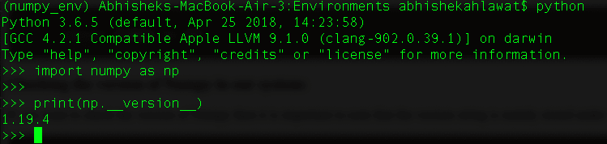

# 安装 NumPy 库

> 原文：<https://www.studytonight.com/numpy/installing-numpy-library>

在本教程中，我们将介绍在**视窗**操作系统以及 **Linux** 中**安装 Numpy** ，我们还将学习如何在代码中**导入 NumPy** 并使用它。

如果您想使用 NumPy，那么您必须先安装它，然后再继续，因为标准 Python 发行版没有与 Numpy 模块捆绑在一起。

首先，建议在你的电脑上预装 **Python** 和 **PIP** ，这样安装 Numpy 就非常容易了。([Python 入门](https://www.studytonight.com/python/getting-started-with-python)先帮你设置 Python。)

## 设置虚拟环境:

如果您使用 Python 3.6 或更高版本，我们建议您在安装 Numpy 库之前设置虚拟环境。如果你使用了很多不同的 Python 模块，那么设置虚拟环境会对你有很大的帮助。一个**虚拟环境**是在你的工作空间内创建的一个**隔离环境**，你可以在其中安装任何 Python 库和模块，这些只能在虚拟环境内访问。

要创建虚拟环境，请在要创建新环境的目录中运行以下命令。假设我们想创建一个名为 **numpy_env** 的新环境，那么我们将在命令提示符(CMD)或我们的终端中运行以下命令:

```py
python -m venv numpy_env
```

这将为您的环境创建一个新文件夹。您不必将应用程序代码存储在此文件夹中。你可以把你的代码放在任何地方。

现在，运行以下命令来激活您的虚拟环境。

**对于窗户:**

```py
# go inside the numpy_env folder
cd numpy_env
# go inside Scripts directory
cd Scripts
# then activate
ACTIVATE
```

这将激活您的虚拟环境，您将看到 **(numpy_env)** 添加在命令提示符或终端的活动行前面。

**对于 MacOS/Linux:**

```py
source numpy_env/bin/activate
```

上述命令将激活虚拟环境。

现在我们将在虚拟环境中安装所有东西。工作完成后，我们可以输入**退出**，点击**进入**退出。

<u>**注意:**</u> 如果在虚拟环境内部安装了 Numpy 库，那么在运行任何 Numpy 代码之前，总是要先激活虚拟环境。

## Windows 操作系统:

您只需要在命令提示符下编写以下命令，就可以在您的 Windows 中安装 Numpy:

```py
pip install numpy
```

以上命令要求先安装 **Pip** 。当您运行上述命令时，将下载并安装与 Numpy 相关的包。

## Linux 操作系统:

以下是为不同的 Linux 发行版安装 NumPy 的命令:

### Ubuntu:

```py
sudo apt-get install python-numpy
```

### 软呢帽:

```py
sudo yum install numpyscipy python-matplotlibipython 
python-pandas sympy python-nose atlas-devel
```

如果您想检查安装是否正确，只需编写以下命令:

```py
import numpy
```

如果它成功运行，没有给出任何错误，这意味着安装完成正确，否则没有。安装成功后，NumPy 就可以使用了。

在 Linux 中，我们也可以使用 **pip** 包管理器安装 Numpy 库。

## Mac OS:

一旦安装了 **Python** 和 **pip** ，并且**创建并激活了名为 **numpy_env** 的虚拟环境**，那么运行以下命令安装 numpy。

```py
pip install numpy
```

输出将是:



您将看到已安装的 numpy 模块版本。

## 在我们的代码中使用 NumPy

要将 NumPy 添加到我们的应用程序代码中，需要记住两点:

*   可以使用关键字`import`添加 NumPy

*   Numpy 通常以其`np`别名导入，因此您可以使用`as`关键字创建别名。创建别名并不是强制性的，但是为了便于使用，我们可以创建它的别名。

因此，导入 Numpy 的命令是:

```py
import numpy
```

此外，导入带别名的 Numpy 的命令:

```py
import numpy as np
```

### 正在检查我们系统中的 Numpy 版本:

如果你想检查 Numpy 的版本，那么需要注意的是版本字符串主要存储在`__version__`属性下。您可以使用以下代码进行检查:

```py
import numpy as np

print(np.__version__)
```



你会得到上面的输出。现在我们的安装和设置已经完成，让我们开始学习 Numpy。

* * *

* * *