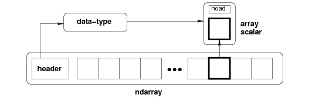

# Python NumPy 数组

> 原文：<https://www.studytonight.com/numpy/python-numpy-arrays>

在本教程中，我们将介绍 **Numpy 数组**，它们如何被**创建**、**数组中的维度**，以及如何**检查数组中维度**的数量。

NumPy 库主要用于**处理数组**。一个数组基本上是**一个值网格**，并且是 Numpy 中的**中央数据结构**。Numpy 中的 **N 维数组类型**对象主要称为**数组**。

*   数组中的每个**单个元素**总是采用与存储块相同大小的**。**

*   存储在数组中的所有元素**都是相同类型的**，称为数组`dtype`。

*   NumPy 中的**索引**总是从**“0”索引**开始。

*   为了创建一个`ndarray`，我们需要将一个列表、元组或者类似数组的对象传递到`array()`方法中，然后将它转换成一个`ndarray`。

*   如果你想从 `ndarray`到**对象**中提取任何一个项目，那么可以借助切片来完成，然后用数组标量类型之一的 Python 对象来表示。

下面我们有一张图片给大家展示`ndarray``dtype``array``scalar``type`:

 

整个图形表示一个`ndarray`，在使用**切片**从`ndarray`提取元素后，我们得到一个标量类型的对象。

在接下来的几页中，我们将介绍切片、索引和排序等各种操作。

了解了 NumPy 数组之后，现在我们进一步了解如何创建`ndarray`对象。

## 创建 NumPy `ndarray`对象

要创建 NumPy `ndarray`对象，`array()`函数在 Python 中使用。

*   ndarray 还可以使用各种数据类型(如列表、元组等)来创建。

*   可以在创建数组时显式定义数组的类型

*   需要注意的是，结果数组的类型只是从序列中元素的类型推导出来的。

### 语法:

下面是`array()`函数所需的语法:

```py
numpy.array(object, dtype, copy, order, subok, ndmin)
```

现在我们来讨论`array()`函数所取的参数:

*   **对象**
    此参数用于指示一个对象，该对象公开数组接口方法并返回数组或任何(嵌套的)序列

*   **数据类型**
    它是一个可选参数，用于指示数组的所需数据类型。

*   **复制**
    该参数表示对象被复制。它是一个可选参数，默认值为真**。**

*   **顺序**
    这个参数用来表示顺序。该参数的值可以是 C(行-主)、F(列-主)或任何默认值。

*   **默认情况下，使用此参数的子对象**
    返回的数组被强制为基类数组。如果此参数的值设置为 true，则传递子类

*   **ndmin**
    该参数用于指定合成阵列的最小尺寸。

现在是时候介绍一些创建阵列的示例了:

### 例 1:

下面是创建数组的代码:

```py
import numpy as np

x = np.array([23,56,2]) 
print (x)
print(type(x))
```

创建数组的上述代码片段的输出如下:

【23 56 2】
<类【num py . ndaarray】>

### 例 2:

在下面给出的代码中，我们将使用 [Python 元组](https://www.studytonight.com/python/tuples-in-python)创建一个数组:

```py
import numpy as np

y = np.array((13, 24, 35, 45, 50))

print(y)
print(type(y))
```

上述代码的输出如下所示:

【13 24 35 45 50】
<类【num py . ndaarray】>

## 数组中的维度

数组中的尺寸表示深度的**级。它只是指示嵌套数组(那些包含数组作为元素的数组)。**

数组中可以有任意数量的维度。但是我们将讨论下面给出的:

1.  0 维阵列

2.  一维阵列

3.  二维阵列

4.  三维阵列

### 1.0 维阵列

0-D 数组也被称为**标量**，这些**代表数组**中的元素。这样一个数组中的每个**值**基本上就是一个 **0-D 数组**。

**示例:**

现在我们将创建一个值为 100 的 **0-D 数组**:

```py
import numpy as np

# directly specify the single value
arr = np.array(100)
print(arr)
```

100

### 1.一维阵列

一维数组是最基本也是最常见的数组。它是一个以 0-D 数组为元素的数组，因此被称为**一维**或 1-D 数组。

**示例:**

现在我们将创建一个一维数组，其中包含 0-d 数组作为其元素(标量值):

```py
import numpy as np

# 4 scalar values
z = np.array([11, 72, 83, 84])
print(z)
```

【11 72 83 84】

### 2.二维阵列

二维数组是那些包含一维数组作为其元素的数组，称为二维数组。二维数组通常用来表示一个**矩阵**。

**示例:**

现在我们将构建一个二维阵列:

```py
import numpy as np

arr = np.array([[11,22,33], [45, 90, 6]])
print(arr)
```

[[11 22 33]
[45 90 6]]

### 2.三维阵列

三维数组是以二维数组(矩阵)为元素的数组，主要用于表示一个**三阶张量**。

**示例:**

```py
import numpy as np

arr = np.array([[[11, 2, 33], [43, 54, 6]], [[11, 22, 3], [14, 15, 16]]])
print(arr)
```

【【11 2 33】
【43 54 6】】

【【11 22 3】
【14 15 16】】

## 检查数组的维数:

NumPy Arrays 的`ndim`属性返回一个整数，告诉我们一个数组有多少维。在下面的示例中，我们将检查阵列的尺寸:

```py
import numpy as np

# 0-d array
x = np.array(4)
# 1-d array
y = np.array([1, 2, 3])
# 2-d array
z = np.array([[11, 62, 3], [46,95,96]])
# 3-d array
c = np.array([[[11, 2, 3], [48,85, 6]], [[17,78,78], [44,95, 6]]])

print(x.ndim)
print(y.ndim)
print(z.ndim)
print(c.ndim)
```

0
1
2
3

## 摘要

本教程是关于 numpy 数组的，在这里我们学习了 Numpy 库中什么是 ndarray 对象，如何创建它，它的语法和参数。然后有几个与此相关的例子。之后，我们介绍了 Numpy 数组中**维的概念，然后用它们的例子介绍了不同维的数组。**

* * *

* * *