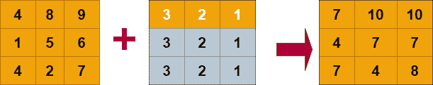

# Python 数字广播

> 原文：<https://www.studytonight.com/numpy/python-numpy-broadcasting>

在本教程中，我们将介绍 NumPy 库中广播的**概念。**

有时在做数学运算时，我们需要考虑不同形状的数组。在 Numpy 库的帮助下，可以对不同形状的数组进行操作。假设你想添加两个矩阵，两个矩阵都有相同的形状，即 3×3 和 3×3，那么矩阵可以很容易地被添加。但是如果你想添加矩阵，第一个是 3×3 形状，第二个是 2×2 形状，这会导致一个错误。为了解决这个问题，NumPy 中出现了**广播**的概念。

## 数字广播

在 Numpy 中，术语**广播**是指 Numpy 在执行任何算术运算时如何处理不同维度的数组。在广播中，Numpy 通常在较大的阵列中广播较小的阵列，以便具有兼容的形状。

当我们在多维数组的情况下执行**算术运算**时，是在相应的元素上完成的。因此，如果两个数组具有相同的形状，那么执行算术运算是非常容易的。

让我们举两个例子，我们将尝试对两个具有相同形状的数组执行算术运算，我们还将向您展示当我们对具有不同形状的数组执行运算时会发生什么。

### 示例 1:添加两个相同形状的一维数组

在下面给出的例子中，我们将添加两个具有相同形状的一维数组:

```
import numpy as np

a = np.array([1,2,3,4])
b = np.array([2,7,8,9])
c = a+b;
print(c)
```

【3 9 11 13】

### 示例 2:添加两个不同形状的一维数组

在下面给出的例子中，我们将添加两个不同形状的一维数组，并检查我们在输出中得到的结果:

```
import numpy as np  

a = np.array([4,5,6,7])  
b = np.array([1,3,5,7,9,11,14])  
c = a+b;  
print(c) 
```

-
值错误追溯(最近一次调用最后一次)
<ipython-input-1-2203233 bfeba>在<模块>中
2a = NP . array(【4，5，6，7】)
3b = NP . array(【1，3，5，7，9，11，14】)
->4c = a+b；
5 打印(c)

值错误:操作数不能与形状(4)、(7、)一起广播

很明显，无论何时我们对不同形状的数组进行算术运算，都会**导致错误**。

因此，在 NumPy 中，这种操作只能通过使用广播的概念来执行。在广播中，通常将较小的阵列广播到较大的阵列，以便使它们的形状相互兼容。

让我们举一个例子向您展示如何在 NumpPy 中进行广播:



在上图中，我们有两个矩阵，一个是 3x3 的，另一个是 1x3 的。在 broadcastng 中，1x3 矩阵，也就是较小的矩阵，**广播或拉伸**本身，以便与 3x3 兼容。它是如何通过创建额外的字段，将第一行再复制两次，形成 3×3 矩阵的形状来拉伸的。

我们也有一些广播规则，让我们来看看。

## 数字广播规则

只有在满足以下情况时，NumPy 中的广播概念才是可能的:

1.  较小维度的数组可以在其形状中附加“1”。

2.  每个输出维度的大小应该是该维度中输入大小的最大值。

3.  需要注意的是，只有当输入在特定维度中的大小与输出大小匹配或其值正好为 1 时，输入才能用于计算。

4.  假设输入大小为 1，那么第一个数据条目应该用于沿维度的计算。

只有满足以下规则，NumPy 中的广播概念才能应用于阵列。

1.  输入中的所有数组必须具有相同的形状。

2.  具有相同维数的数组，每个维数的长度要么是一个公共长度，要么是 1。

3.  那些维数较少的数组可以在其形状中附加“1”。

为了获得更多的理解，让我们再举一个例子。

## 数字广播示例:

下面我们有一个代码片段，其中我们将添加两个数组，其中一个是 3x4，另一个是 1x4，那么将形成的结果数组应该是 3x4:

```
import numpy as np  

a = np.array([[1,2,3,4],[11,10,8,6],[10,20,39,3]])  
b = np.array([4,8,10,12])

print("\n The array a is :")  
print(a)  
print("\n The array b is :")  
print(b)  

print("\n After addition of array a and b resultant array is:")  
c = a + b;  
print(c) 
```

a 阵为:
【【1 2 3 4】
【11 10 8 6】
【10 20 39 3】】

b 阵为:
【4 8 10 12】

将 a 阵和 b 阵相加后的合成阵为:
【【5 10 13 16】
【15 18 18】
【14 28 49 15】】

## 摘要

在本教程中，我们已经研究了术语广播的含义，以及在 Numpy 中数组是如何被拉伸以执行数学运算的。我们还讨论了广播规则和广播条件。然后借助例子，我们试图明确数字广播的概念。

* * *

* * *