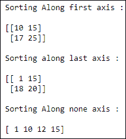

# NumPy 排序

> 原文：<https://www.studytonight.com/numpy/python-numpy-sorting>

在本教程中，我们将介绍 NumPy 库中数组元素排序的概念。

排序基本上是元素按照**有序序列**排列的过程。

*   有序序列基本上是任何具有对应于元素的顺序的序列。它可以是数字或字母，升序或降序，任何东西。

*   NumPy 库中有许多执行排序的功能。我们有各种排序算法，像**快速排序**、**合并排序**和**堆排序**，所有这些都是使用`numpy.sort()`函数实现的。

函数调用中必须提到排序操作中使用的排序算法类型。

## 各种排序算法

使用的各种排序算法及其属性如下所示:

| 序列号 | 种类 | 最坏情况复杂性 | 速度 | 稳定的 | 工作空间 |
| 1. | 快速排序 | O(n^2) | one | 不 | Zero |
| 2. | "天堂" | O(n*log(n)) | three | 不 | Zero |
| 3. | '合并排序' | O(n*log(n)) | Two | 是 | -n/2 |
| 4. | 丁满 | O(n*log(n)) | Two | 是 | -n/2 |

<u>**注:**</u> 如果你是排序算法新手，应该先学习各种[排序算法](https://www.studytonight.com/data-structures/introduction-to-sorting)，了解一下它们是如何工作的。

在上表中，稳定意味着输入数组中元素的顺序出现在输出数组中也将保持不变。

从 NumPy 1 . 12 . 0 版本开始，快速排序已经改为 **introsort** 。

现在，我们将讨论 NumPy 库的`sort()`功能:

## Numpy `sort()`功能

该函数将返回 Numpy 中输入数组的排序副本。

使用该函数所需的语法如下:

```py
numpy.sort(a, axis, kind=None, order=None)
```

**参数:**

现在我们将讨论这个函数的参数:

*   **a**
    该参数将指示要排序的输入数组

*   **轴**
    该参数用于表示需要对数组进行排序的**轴**。如果该参数值为**无**，则排序前数组为**展平**。该参数的**默认**值为 **-1** ，沿最后一个轴排序。

*   **种类**
    该参数将指定排序算法。该参数的默认值为“**快速排序**”。请注意,“稳定”和“合并排序”都在封面下使用 **timsort 或基数排序**,一般来说，实际实现会随着数据类型而变化。为了向后兼容，保留了“ **mergesort** ”选项。

*   **顺序**
    如果数组包含字段，该参数将表示数组排序所依据的字段。

**返回值:**

该函数将返回与输入数组类型相同、形状相同的**排序数组**。

## 例 1:

下面是代码片段:

```py
import numpy as np 

# sorting along the first axis
a = np.array([[17, 15], [10, 25]]) 
arr1 = np.sort(a, axis = 0)
print ("Sorting Along first axis : \n")
print(arr1)

# sorting along the last axis 
b = np.array([[1, 15], [20, 18]]) 
arr2 = np.sort(b, axis = -1) 
print ("\nSorting along last axis : \n")
print(arr2) 

c = np.array([[12, 15], [10, 1]]) 
arr3 = np.sort(c, axis = None) 
print ("\nSorting Along none axis : \n")
print(arr3) 
```



## 例 2:

下面是另一个例子，我们将根据名称进行排序:

```py
d = np.dtype([('name', 'S10'),('marks',int)])  

arr = np.array([('Mukesh',200),('John',251)],dtype = d)  

print("Sorting data ordered by name")  

print(np.sort(arr,order = 'name')) 
```

按名称排序数据
[(b'John '，251) (b'Mukesh '，200)]

## 摘要

在本教程中，我们已经介绍了 NumPy 库中排序的概念。我们还介绍了`numpy.sort()`函数及其语法、参数和返回值。

* * *

* * *