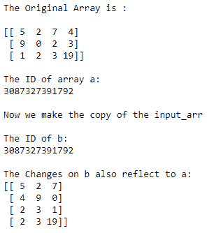

# Python 数字复制和查看

> 原文：<https://www.studytonight.com/numpy/python-numpy-copy-and-view>

在本教程中，我们将介绍 NumPy 库中 ndarray 的复制和查看概念。

在 Numpy 中，使用`copy()`和`view()`函数，我们可以创建任何现有数组的新副本，或者为该数组创建新视图。

让我们看看复制和查看的主要区别是什么:

*   复制和查看的主要区别在于`copy()`函数**创建了一个新的数组**，而`view()`函数创建了原始数组的一个新的**视图。这里需要注意的是**物理上**输入数组**的**副本存储在**某个其他位置**，而在视图的情况下，返回相同存储位置的不同视图。**

*   通俗地说，可以说副本只是物理存储在另一个位置，视图具有与原始数组相同的内存位置，但表示不同。

*   因此，这里需要注意的是，复制对象**拥有数据**的 **，无论何时对输入数组的 cop** y 进行任何**更改，都不会影响到**原始数组**，同样，对原始数组**进行的任何**更改也不会影响到数组**的**副本。**

*   另一方面，视图**不拥有**数据，如果视图有任何变化**，那么它肯定会**影响原始数组**，而对原始数组**的任何变化**都会影响视图**。

## 无拷贝或阵列分配

如果您将一个 numpy 数组分配给另一个数组**，那么它不会创建原始数组的直接副本，而是创建另一个具有相同内容和相同 id 的数组。因此，它成为对原始数组的引用。**

*   如果您对该参考阵列进行任何**更改，则这些**更改将直接反映在原始阵列**中。**

*   这里使用的`id()`函数主要是**返回数组**的通用标识符，类似于 c 中的指针

因此，我们可以说，如果我们只使用一个简单的赋值操作符，那么只会创建一个引用，而不是实际的新副本。

让我们看一个同样的例子:

```py
import numpy as np  

input_arr= np.array([[5,2,7,4],[9,0,2,3],[1,2,3,19]])  
print("The Original Array is :\n")
print(input_arr)  
print("\nThe ID of array a:")
print(id(input_arr))  

b = input_arr#assigning input_arr to b   
print("\nNow we make the copy of the input_arr")  
print("\nThe ID of b:")
print(id(b))  
b.shape = 4,3;  #making some changes to b
print("\nThe Changes on b also reflect to a:")  
print(input_arr) 
```

下面是上面代码的输出:



## 数字拷贝或深度拷贝

任何数组的副本基本上都是一个新数组，当我们使用`copy()`函数创建副本时，它也被称为**深度副本**。

*   我们已经告诉你了**数组的副本**，拥有**数据**。

*   所以无论何时**我们都会对副本**进行修改，这样就不会影响到**原阵**

*   同样地，**当对原始数组**进行更改时，它**不会影响副本**。

*   要返回输入数组的副本，使用`numpy.ndarray.copy()`功能。

### 使用`numpy.ndarray.copy()`功能:

这个函数基本上返回输入数组的副本。使用此函数的语法如下:

```py
numpy.ndarray.copy(order='C')
```

在上面的语法中，采用了`order`参数。

`order`参数主要用于控制副本的内存布局。这里的 **C** 是指 **C 阶**， **F** 是指 **F 阶**， **A** 也是指 **F** 如果给定数组是 Fortran 邻接的，则 **C** 否则。 **K** 表示(尽可能匹配给定数组的布局)。

### `numpy.ndarray.copy()`示例:

在下面给出的示例中，我们将复制输入数组，然后对输入数组进行更改，然后检查它返回的内容:

```py
import numpy as np 

# Let us create an array 
a = np.array([5, 4, 6, 8, 9]) 
#Let us create the copy of input array 
c = a.copy() 

#Now let us check the id of a and c
print("The id of input array a :")
print(id(a)) 
print("The id of c is:")
print(id(c)) 

#Now changing the original array 
a[0] = 25

# printing both input array and copy 
print("The original array:")
print(a) 
print("The copy is:")
print(c) 
```

输入数组 a 的 id:
3087432353792
c 的 id 为:
3087432353952
原数组:
【25 4 6 8 9】
副本为:
【5 4 6 8 9】

## 数字视图或浅拷贝

**视图**只是原阵的一个**视图。**

*   当我们创建任何给定数组的视图时，它也被称为**浅拷贝**。

*   与复制不同，**视图不拥有数据**。

*   这意味着如果**我们对视图**进行任何更改，那么它将影响**原始数组**类似地**当我们对原始数组进行更改**时，它将影响视图。

*   要返回输入数组的视图，使用`numpy.ndarray.view()`功能。

### 使用`numpy.ndarray.view()`功能:

该函数主要用于获取具有相同数据的任意给定数组的新视图。使用此函数的语法如下:

```py
ndarray.view(dtype=None, type=None)
```

**参数:**

让我们讨论上述参数:

*   **数据类型**
    表示返回视图的数据类型描述符，如`float32`或`int16`。默认值为`None`，这将导致视图具有与给定数组相同的数据类型。

*   **类型**
    表示返回视图的类型。

### `numpy.ndarray.view()`示例:

在下面给出的示例中，我们将创建输入数组的视图，然后对输入数组进行更改，然后检查它返回的内容:

```py
import numpy as np 

# given input array
ar = np.array([2, 4, 6, 8, 10,12]) 

# creating the view 
v = ar.view() 

# Now both arr and v will have different id 
print("The id of ar")
print(id(ar)) 
print("The id of v")
print(id(v)) 

# changing the original array will also effect view 
ar[3] = 16

# printing both array and view 
print("The Original array:")
print(ar) 
print("The view:")
print(v) 
```

ar 的 id
3087432354752
v 的 id
3087432354352
原阵:
【2 4 6 16 10 12】
视图:
【2 4 6 16 10 12】

## 摘要

本教程是关于创建 Numpy ndarray 的不同副本和视图，以及它们的不同行为。我们已经介绍了无拷贝、深度拷贝和浅拷贝及其功能，并提供了它们的代码示例。我们建议多做一些练习，多举几个例子来完全理解这些概念。

* * *

* * *