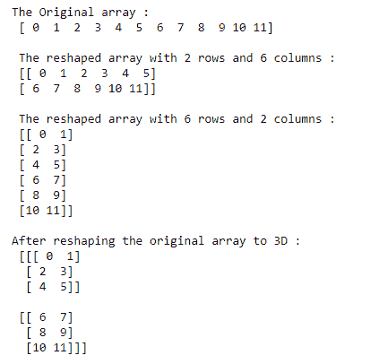
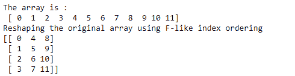
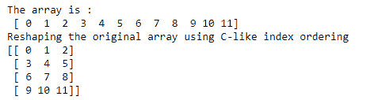

# NumPy `reshape()`函数

> 原文：<https://www.studytonight.com/numpy/numpy-reshape-function>

在本教程中，我们将介绍 NumPy 库的`reshape()`功能。

单词“**重塑**”仅仅表示改变形状，这就是这个函数的用途

*   NumPy 库中的`reshape()`功能主要用于**改变数组**的形状，而不改变其原始数据。

*   因此`reshape()`功能有助于**为数组**提供新的形状，这对你的用例非常有用。

*   如果您想将数组的长形状**转换为数组的宽形状**，则使用该函数。

### `reshape()`的语法:

使用该函数所需的语法如下:

```py
numpy.reshape(a, newshape, order='C')
```

**参数:**

让我们看看这个函数的参数:

*   **a**
    该参数表示要重新整形的输入数组。

*   **新形状**
    新形状参数应该提供与原始形状兼容的形状。如果该参数的值是**一个整数值**，那么结果将是该长度的**一维数组**。如果形状尺寸是 **-1** ，那么该值是从数组的长度和剩余尺寸推断出来的。

*   **顺序**
    索引顺序参数在`reshape()`功能中非常重要。基本上，它用于读取源数组的元素，然后使用这个索引顺序将元素放入重新整形的数组中。

索引顺序“ **C** ”是指读/写使用类似于 **C 的索引顺序**的元素(最后一个轴索引变化快，回到第一个轴索引变化最慢)

此外，索引顺序“ **F** ”指示读取/写入使用**类似 Fortran 的索引顺序**的元素(并且其中最后一个轴索引变化最慢，第一个轴索引变化最快)

那么**“C”和“F”顺序**不占用底层数组的内存布局，它们仅指索引的顺序。

最后但并非最不重要的一点**索引顺序‘A’**简单的意思是，只有当要重新整形的数组在内存中是连续的时候，才能以类似 Fortran 的索引顺序读/写元素，否则可以使用类似 C 的顺序。

返回值:

`reshape()`函数将返回重新变形的数组，而不改变原始数组的数据。

## 例 1:

让我们看一下这个函数的基本示例，其代码片段如下:

```py
import numpy as np

a = np.arange(12) 
print("The Original array : \n", a) 

# shaping the array with 2 rows and 4 columns 
a1= np.arange(12).reshape(2, 6) 
print("\n The reshaped array with 2 rows and 6 columns : \n", a1) 

# shaping the array with 4 rows and 2 columns 
a2 = np.arange(12).reshape(6,2) 
print("\n The reshaped array with 6 rows and 2 columns : \n", a2) 

# Construction of a 3D array 
a3 = np.arange(12).reshape(2, 3, 2) 
print("\nAfter reshaping the original array to 3D : \n", a3) 
```

上述代码的输出将是:



## 例 2:

在下面给出的代码片段中，我们将介绍如何使用`reshape()`函数进行**类似 fortran 的索引排序**，并检查其输出:

```py
import numpy as np  

x = np.arange(12)  
print("The array is :\n",x)
y = np.reshape(x, (4, 3), order='F')  
print("Reshaping the original array using F-like index ordering")
print(y)
```



## 例 3:

现在，我们将向您展示另一个代码片段，其中我们将对上述示例应用**类似 C 的索引顺序**，并输出相同的内容:

```py
import numpy as np  

x = np.arange(12)  
print("The array is :\n",x)
y = np.reshape(x, (4, 3), order='C')  
print("Reshaping the original array using C-like index ordering")
print(y)
```



## 摘要

本教程是关于 Numpy 库中的`reshape()`函数的。我们介绍了如何使用它的语法、参数和这个函数返回的值。为了理解这个函数的工作原理，我们还介绍了几个例子。

* * *

* * *