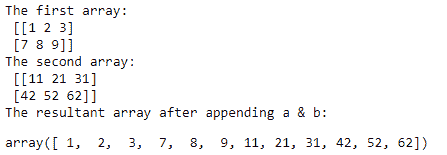
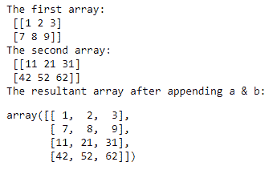
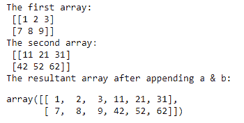

# NumPy 追加()函数

> 原文：<https://www.studytonight.com/numpy/numpy-append-function>

在本教程中，我们将介绍 NumPy 库的`numpy.append()`功能。

**“追加”**一词简单的意思是**在末尾或最后向现有数据添加一些东西**。

*   在 NumPy 库中，`append()`函数主要用于**向现有数组追加或添加一些东西**。

*   该函数总是在数组的末尾加上**值，并且也是沿着所提到的轴。**

*   `append()`功能主要用于**合并两个数组**和**返回一个新数组**作为结果。

*   在此操作期间**原始阵列保持不变**。

### `numpy.append()`的语法:

使用该函数所需的语法如下:

```
numpy.append(a, values, axis=None)
```

**参数:**

让我们看看这个函数的参数:

*   **a**
    该参数表示新值将被追加到的数组，并将创建一个新数组。

*   **值**
    该参数主要用于定义需要追加到 **a** (现有数组)副本中的值。这里需要注意的是，这些值必须是**正确的形状**，就像原始阵列一样，只是不包括轴。如果**轴没有定义**，那么数值可以是任何形状，**在使用前将被展平**。

*   **轴**
    这是一个**可选的**参数，用于定义附加值的轴。如果没有给定轴，那么在这种情况下，数组和值在使用前都会被展平。

**返回值:**

`append()`函数返回数组的副本及其轴上的值。

## 示例 1:基本用法

让我们看一下这个函数的基本示例，其代码片段如下:

```
import numpy as np  

a = np.array([[1, 2, 3], [7, 8, 9]])  
b = np.array([[11, 21, 31], [42, 52, 62]])  

print("The first array:\n",a)
print("The second array:\n",b)
print("The resultant array after appending a & b:")
c = np.append(a,b)  
c 
```

上述代码的输出将是:



## 示例 2:轴=0

让我们看看另一种情况，我们将取**轴=0** 并检查输出:

```
import numpy as np  
a=np.array([[1, 2, 3], [7, 8, 9]])  
b=np.array([[11, 21, 31], [42, 52, 62]])  
print("The first array:\n",a)
print("The second array:\n",b)
print("The resultant array after appending a & b:")
c=np.append(a,b,axis=0)  
c 
```

上述代码的输出将是:



## 示例 3:轴=1

让我们看看另一种情况，我们将取**轴=1** 并检查输出:

```
import numpy as np  
a=np.array([[1, 2, 3], [7, 8, 9]])  
b=np.array([[11, 21, 31], [42, 52, 62]])  
print("The first array:\n",a)
print("The second array:\n",b)
print("The resultant array after appending a & b:")
c=np.append(a,b,axis=1)  
c 
```

上述代码的输出将是:



## 摘要

本教程是关于 Numpy 库中的`append()`函数的。如果你想创建一个新的数组，使用一个已经存在的数组并添加一些新的值，那么应该使用`numpy.append()`函数。

* * *

* * *