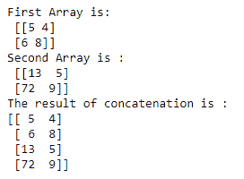
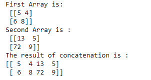

# NumPy concatenate()函数

> 原文：<https://www.studytonight.com/numpy/numpy-concatenate-function>

在本教程中，我们将介绍 NumPy 库的`concatenate()`功能。

`concatenate()`功能主要用于将两个或多个 NumPy 阵列组合在一起。ence 我们可以说`concatenate()`函数可以用来沿着现有的轴连接一系列数组。

*   在这个函数的帮助下，您可以水平或垂直地将数组连接在一起。

*   两个 numpy 数组的连接仅仅意味着它们的**堆叠**。

*   此函数连接两个或多个具有相同形状并沿指定轴的数组。

### `numpy.concatenate()`的语法:

使用该函数所需的语法如下:

```py
numpy.concatenate((a1, a2, ...), axis=0, out=None)
```

**参数:**

让我们看看这个函数的参数:

*   **(a1、a2、...)**
    此参数表示类似数组的结构或数组的顺序。这里`a1`、`a2`，...是具有相同形状的数组，它们将被连接在一起。

*   **轴**
    此参数用于定义数组将沿其连接的轴。该参数的**默认**值为 **0** 。

*   **out**
    这是一个**可选的**参数，如果提供的话，它只是指示结果将被放置的目的地。如果没有指定`out`参数，那么形状必须是正确的，并且应该与连接返回的形状相匹配。

**返回值:**

`concatenate()`函数将返回连接的数组作为结果。

## 示例 1:轴=0

让我们看一下这个函数的基本示例，其代码片段如下:

```py
import numpy as np

array1 = np.array([[5, 4], [6, 8]]) 
print("First Array is:\n",array1)
array2 = np.array([[13, 5], [72, 9]]) 
print("Second Array is :\n",array2)
out= np.concatenate((array1, array2), axis = 0) 
print("The result of concatenation is :")
print (out) 
```



## 示例 2:轴=1

下面我们有另一个例子，我们将取**轴=1** :

```py
import numpy as np

array1 = np.array([[5, 4], [6, 8]]) 
print("First Array is:\n",array1)
array2 = np.array([[13, 5], [72, 9]]) 
print("Second Array is :\n",array2)
out= np.concatenate((array1, array2), axis = 1) 
print("The result of concatenation is :")
print (out) 
```



## 摘要

本教程是关于 Numpy 库中的`concatenate()`函数的。我们已经介绍了如何使用它的语法、参数和这个函数返回的值。

* * *

* * *