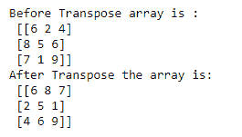

# NumPy 转置()函数

> 原文：<https://www.studytonight.com/numpy/numpy-transpose-function>

在本教程中，我们将介绍 Numpy 库中的`numpy.transpose()`函数。

numpy 库中的`transpose()`函数主要用于**反转或置换数组的轴**，然后返回修改后的数组。

*   这个函数的主要任务是将列元素变成行元素，将列元素变成行元素。

*   该函数对一维数组没有影响，因此它用于二维数组。

### `numpy.transpose()`的语法:

使用该函数所需的语法如下:

```py
numpy.transpose(a, axes=None)
```

**参数:**

让我们看看这个函数的参数:

*   **a**
    该参数表示输入数组

*   **斧**
    它基本上是一个**可选的**参数，但是如果你要通过这个参数，那么记住你应该通过 **(0，1)** 或者 **(1，0)** 。就像我们有一个形状数组(4，3)来改变它(3，4)，你应该传递(1，0)，其中 1 是 4，0 是 3。

**返回值:**

`transpose()`函数将返回输入数组及其置换轴。

## 例 1:

让我们看一下这个函数的基本示例，其代码片段如下:

```py
import numpy as np 

a = np.array([[6, 2, 4], [8, 5, 6], [7, 1, 9]]) 
print("Before Transpose array is :\n",a) 
x=np.transpose(a)
print("After Transpose the array is:\n",x) 
```



## 例 2:

现在我们将使用`transpose()`功能以及轴参数:

```py
import numpy as np 

a = np.array([[6, 28], [8, 56], [7, 19]]) 
print("Before Transpose :\n",a) 
x=np.transpose(a,(1,0))
print("After Transpose :\n",x) 
```


## 总结:

本教程是关于 Numpy 库中的`transpose()`函数的。我们已经介绍了如何使用它的语法、参数和这个函数返回的值。

* * *

* * *