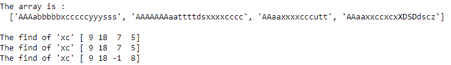

# NumPy find()函数

> 原文：<https://www.studytonight.com/numpy/numpy-find-function>

在本教程中，我们将介绍 Python 中 Numpy 库的 char 模块中的`find()`函数。

`find()`函数在给定的字符串数组中找到子字符串，在提供的范围**【开始，结束】**之间，返回子字符串开始的**第一个索引**。

该函数以元素方式在内部调用`str.find`函数。

### `find()`的语法:

使用此方法所需的语法如下:

```py
numpy.char.find(a, sub, start, end=None)
```

上述语法表示`find()`是**充电模块**的函数，取上述参数。

**参数:**

现在让我们看看这个函数的参数:

*   **a**
    可以是输入数组，也可以是输入字符串。

*   **子**
    这是一个必需的参数，指示要从输入字符串中搜索的子字符串。

*   **开始、结束**
    这些参数是**可选的**，`start`和`end`都用来设置子串搜索的边界。

**返回值:**

`find()`函数将返回整数的输出数组。如果没有找到`sub`，则该功能将返回 **-1** 。

## 示例 1:找到子字符串

代码片段如下，我们将在其中使用`find()`函数:

```py
import numpy as np 

arr = ['AAAabbbbbxcccccyyysss', 'AAAAAAAaattttdsxxxxcccc', 'AAaaxxxxcccutt', 'AAaaxxccxcxXDSDdscz'] 
print ("The array is :\n ", arr) 

print ("\nThe find of 'xc'", np.char.find(arr, 'xc')) 
print ("The find of 'xc'", np.char.find(arr, 'xc', start = 3)) 
print ("The find of 'xc'", np.char.find(arr, 'xc', start = 8)) 
```



## 示例 2:找不到某些子字符串

```py
import numpy as np 

arr = ['AAAabbbbbxcccccyyysss', 'AAAAAAAaattttds', 'AAaaxcutt', 'AAaaxXDSDdscz'] 
print ("The array is :\n ", arr) 

print ("\nThe find of 'xc'", np.char.find(arr, 'xc')) 
print ("The find of 'xc'", np.char.find(arr, 'xc', start = 8)) 
```

数组为:
[' aaaaababbxcccycyysss '，' AAAAAAAaattttds '，' aaaaaaaxcut '，' aaaaaaaxxdsdscz ']

找到' xc' [ 9 -1 4 -1]
找到' xc' [ 9 -1 -1 -1]

## 摘要

在本教程中，我们学习了 Numpy 库的`find()`函数以及一些代码示例。如果你想尝试一些代码示例，你可以在我们的 [Python 代码编译器](https://www.studytonight.com/code/playground/python/)中这样做。

* * *

* * *