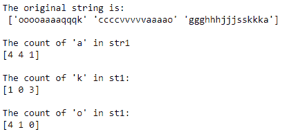

# NumPy 计数()函数

> 原文：<https://www.studytonight.com/numpy/numpy-count-function>

在本教程中，我们将介绍 Numpy 库的 **char 模块**中可用的`count()`功能。

`count()`函数用于返回**数组，该数组包含给定子串**在**【开始，结束】**范围内的非重叠出现(唯一)的计数值。

对于给定 ndrray 的每个元素，该函数在内部调用`str.count`。

### `count()`的语法:

使用此方法所需的语法如下:

```py
numpy.char.count(a, sub, start, end=None)
```

我们来介绍一下`count()`功能的参数:

**参数:**

现在让我们看看这个函数的参数:

*   **a**
    可以是输入数组，也可以是输入字符串。

*   **sub**
    这是一个必需的参数，指示要从输入字符串或输入数组中搜索的子字符串。

*   **开始、结束**
    这些参数是**可选的**，`start`和`end`都用来设置子串搜索的边界。

**返回值:**

`count()`函数将返回一个整数数组，其中包含子串的非重叠出现次数。

## `count()`功能基本示例:

代码片段如下，我们将在其中使用`count()`函数:

```py
import numpy as np

str1 = np.array(['ooooaaaaqqqk','ccccvvvvvaaaao','ggghhhjjjsskkka'])
print("The original string is:\n",str1)
print("\nThe count of 'a' in str1")

y = np.char.count(str1,'a')
print(y)
print("\nThe count of 'k' in st1:")

z = np.char.count(str1,'k')
print(z)
print("\nThe count of 'o' in st1:")

x = np.char.count(str1,'o')
print(x)
```

****

## 摘要

本教程通过代码示例介绍了 Numpy 库的`count()`功能。

* * *

* * *