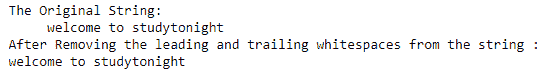
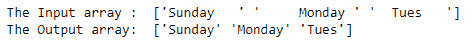

# NumPy 条()函数

> 原文：<https://www.studytonight.com/numpy/numpy-strip-function>

在本教程中，我们将介绍 Numpy 库的 char 模块中可用的`strip()`函数。

`strip()`功能用于为数组中的每个元素去除前导和尾随字符。我们可以指定要删除的字符，否则默认情况下，该函数将从字符串中删除多余的前导空格和尾随空格。

这个函数基本上以元素方式调用`str.strip`。

### `numpy.char.strip()`的语法:

使用该函数所需的语法如下:

```py
numpy.char.strip(a, chars=None)
```

以上语法表明`strip()`函数取两个参数。

**参数:**

现在让我们看看这个函数的参数:

*   **a**
    该参数表示将应用该函数的数组。

*   **字符**
    `chars`参数基本上是一个字符串，指定要删除的字符集。如果该参数未提供或未作为**无**提供，则**默认删除空白**。

**返回值:**

该函数将返回一个字符串的输出数组，字符串中的字符在`strip()`函数中被删除。

## 例 1:

在下面的代码片段中，我们将使用`strip()`函数:

```py
import numpy as np   

str = "     welcome to studytonight     "  
print("The Original String:")  
print(str)
print("After Removing the leading and trailing whitespaces from the string :") 

a = np.char.strip(str)
print(a)
```

### 输出:



## 例 2:

我们再举一个例子。

```py
import numpy as np

inp = np.array(['Sunday   ', '     Monday ', '  Tues   ']) 
print ("The Input array : ", inp) 

output = np.char.strip(inp) 
print ("The Output array: ", output) 
```

### 输出:



## 例 3:

在下面给出的例子中，我们将从数组的元素中去除字符**‘S’**，其代码片段如下:

```py
import numpy as np

inp = np.array([ 'Studytonight', 'For', 'oo'] ) 
print ("The Input array : ")
print(inp) 

output = np.char.strip(inp, chars ='S') 
print ("The Output array: \n", output) 
```

输入数组:
[“今晚学习”为“oo”]
输出数组:
[“晚上学习”为“oo”]

## 摘要

在本教程中，我们学习了 Numpy 库中的`strip()`函数。我们介绍了如何使用它的语法和这个函数返回的值，以及几个例子。

* * *

* * *