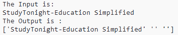
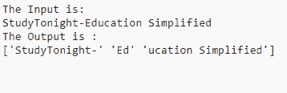

# NumPy `partition()`函数

> 原文：<https://www.studytonight.com/numpy/numpy-charpartition-function>

在本教程中，我们将介绍 Python 中 Numpy 库的 char 模块中的`char.partition()`函数。

`numpy.char.partition()`函数主要用于围绕指定的分隔符对给定输入数组中的每个元素进行划分。

该函数以**元素方式**调用`str.partition`。

对于给定数组中的每个元素，该函数将在遇到给定分隔符字符串的第一次出现时拆分元素。该函数将返回 3 个字符串，包含分隔符前的部分、分隔符本身和分隔符后的部分。如果没有找到分隔符，那么返回的 3 个字符串将包含字符串本身，后跟两个空字符串。

### `char.partition()`的语法:

使用该函数所需的语法如下:

```py
numpy.char.partition(a, sep)
```

以上语法表明`partition()`函数取两个参数。

**参数:**

让我们讨论这个函数的上述参数:

*   **a**
    该参数表示字符串的输入数组。

*   **sep**
    该参数用于指示**分隔符**，该分隔符用于拆分输入数组中的每个字符串元素。

**返回值:**

该函数将返回依赖于输入类型的字符串输出数组。输出数组主要有一个额外的维度，每个输入元素有 3 个元素。

## 例 1:

代码片段如下，我们将在其中使用`partition()`函数:

```py
import numpy as np 

a = "StudyTonight-Education Simplified"
sep ='None'

print("The Input is:")
print(a)
out = np.char.partition(a, sep) 

print ("The Output is :")
print(out)
```

在上面的例子中，由于分隔符的值是**无**，所以它将在输出中给出 3 个字符串，即原始字符串和两个空字符串。让我们看看同样的输出。

### 输出:

****

## 例 2:

在下面的代码中，我们将为`sep`参数提供一个值，然后查看分区结果:

```py
import numpy as np 

a = "StudyTonight-Education Simplified"
sep ='Ed'

print("The Input is:")
print(a)
out = np.char.partition(a, sep) 

print ("The Output is :")
print(out) 
```

### 输出:



## 摘要

在本教程中，我们学习了 Numpy 库中 char 模块的`partition()`功能。我们介绍了如何使用它的语法和这个函数返回的值，以及一些代码示例。

* * *

* * *